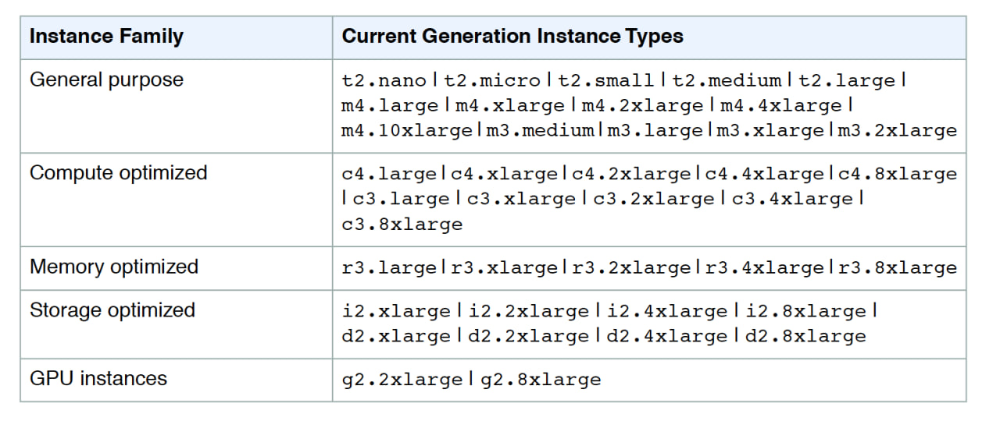
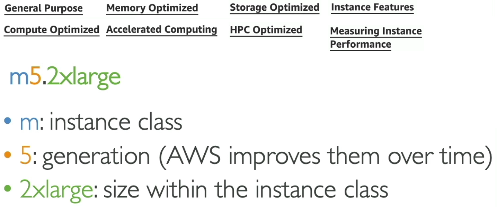
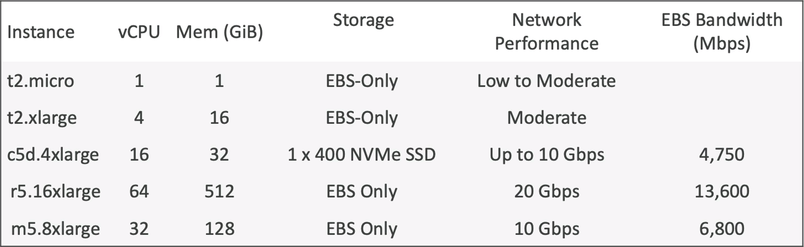
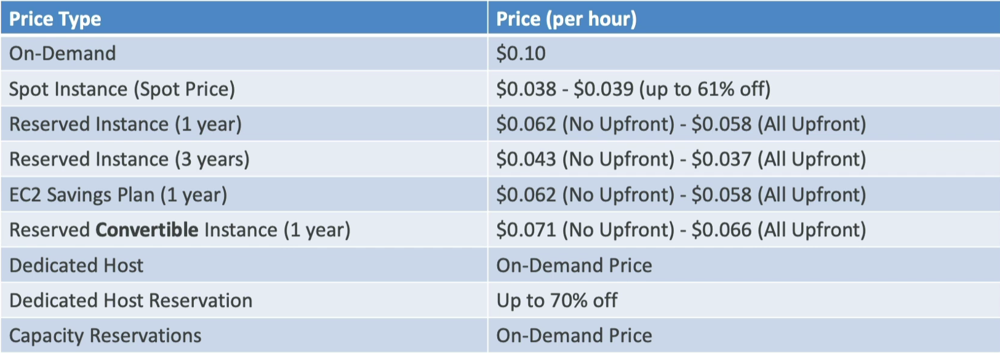

# EC2
## Elastic Compute Cloud
Amazon **EC2** = Infrastructure as a Service
**EC2** состоит из:
- самого инстанса, виртуальной машины - **EC2 Instance**
- хранилище данных, виртуальный диск - **EBS volumes**
- распределяющего нагрузку между инстансами балансировщика - **ELB**
- масштабирующей сервисы группы - **ASG**

## EC2 sizing & configuration options
- OS: Linux, Windows, Mac OS
- CPU:
- Memory:
- Storage space:
  - Network-attached (**EBS** & **EFS**)
  - Hardware-attached (*EC2 Instance Store*)
- Network Cards
- Firewall rules: **Security Group**
- Bootstrap script (набор команд, выполняющихся при запуске инстанса, первый запуск): **EC2 User Data**

**EC2 User Data** нужен для установки обновлений, ПО, общих файлов из интернета, будь чего на самом деле. Запуск идет от root пользователя




[List of all instances types](https://instances.vantage.sh/)

## EC2 Creating

1. При создании EC2 инстанса нам нужно выбрать **Name** и проставить **Tags**: `Key`, `Value`, `Resource types`;
2. Далее нужно выбрать базовый образ для инстанса - **Image**;
3. Далее надо выбрать тип инстанса - **Instance type**;
4. Далее нужно создать ключевую пару для логина на инстанс - **Key pair**;

:::note

Ключевая пара SSH использует технологию public key infrastructure (PKI). Пара ключей — это открытый (*Public*) и закрытый ключи (*Private*). **Private** ключ является секретным, известен только пользователю, его следует зашифровать и безопасно хранить. **Public** ключ может быть свободно передан любому SSH-серверу, к которому пользователь желает подключиться.
* Пример генерации пары:
```bash
ssh-keygen -t ed25519/rsa -C "your_email@example.com"
```
* Пример использования: Добавить **Public Key** как **Deploy Key** в репозиторий [andreasblaze.github.io](https://github.com/andreasblaze/andreasblaze.github.io) и добавить **Private Key** в **GitHub Actions Secrets**.
То шо .pem - **Public Key**, без - **Private Key**.
* Пример подключения к инстансу:
```bash
ssh -i <file_name>.pem <user_name>@<public_ip>
```
* Если есть проблема с доступом (unprotected private key file):
```bash
chmod 0400 <file_name>.pem
```

:::

:::caution

На сервере **Public** ключ, у пользователя **Private** ключ. Каждый раз, когда вы обращаетесь к серверу, происходит сопоставление ключей.

:::

5. Далее идут Network settings, где определяется фаерволл - **Security Group**;
:::info

**Security Group** действует как виртуальный фаерволл для Amazon EC2 instances, AWS Lambda, AWS Elastic Load Balancing и контролирует входящий и исходящий трафик. При запуске инстанса вы можете указать одну или несколько **Security Groups**. Одна **Security Group** может применяться к разным инстансам. **Security Group** прикреплена к одному региону и одной **VPC**.
> "Timeout" - **Security Group** Issue.

> "Connection refused" - Application Issue.

**Security Group** регулирует:
- Доступ к портам (**Ports**);
- **IP** ренжи (IPv4 & IPv6);
- Входящие (**Inbound** or **ingress**) правила контролируют входящий трафик к вашему инстансу (кому и как можно пользоваться инстансом), а исходящие (**Outbound** or **egress**) правила — исходящий трафик из вашего инстанса (кому и как инстанс что-то передает).
:::

6. Далее **Configure storage**, где мы определяем размер и тип корневого тома (`Root volume`). В Advanced режиме можно наконфигурировать кастомные тома используя EBS (*block-storage service*);

:::note

**S3** provides you with a web interface while **EBS** provides a file system interface and EFS provides a web and file system interface. Storage Type: **AWS S3 is object storage** while **Amazon EBS is block storage** and Amazon EFS is file storage.

:::

7. **User Data** - скрипт при запуске.

:::danger

Никогда не надо запускать `aws configure` на EC2, так как это приведет к тому, что персональные токены будут доступны любому пользователю на EC2. Лучше использовать IAM Role.

:::

## EC2 Instances Purchasing Options

Аренда (`Tenancy`) определяет, как экземпляры EC2 распределяются по физическому оборудованию (hardware), и влияет на цены. Возможны три варианта аренды:
- **Shared (default)** — Несколько аккаунтов AWS могут использовать одно и то же физическое оборудование.
- **Dedicated Instance (dedicated)** — Инстанс работает на одноарендном оборудовании.
- **Dedicated Host (host)** — Инстанс работает на физическом сервере с емкостью инстанса **EC2**, полностью выделенной для вашего использования, изолированном сервере с конфигурациями, которыми вы можете управлять.

| Name     | Explanation |
| -------- | --- |
| **On-Demand Instances** | Небольшая рабочая нагрузка. Оплата по секундам работы после первой минуты запуска. Высокая цена, но никаких предоплат. Никаких долгосрочных обязательств. Рекомендуется для **кратковременных** и **непрерывных** рабочих нагрузок, когда невозможно предсказать, как поведет себя приложение. |
| **Reserved** (1 & 3 years) ↓ ↓   | -------- |
| **Reserved Instances** | Длительная рабочая нагрузка (работа базы данных). Дисконты от AWS. Доступна резервация инстанса с атрибутами `Instance Type`, `Region`, `Tenancy`, `OS`. Доступен выбор периода резервации: чем дольше (max 3, min 1), тем бельше дисконд. Вид оплаты: полный аванс - больше дисконд. Резервация доступна либо **Regional**, либо **Zonal** (резервация в определенной AZ). Подходит для приложений с устойчивым использованием (так же база данных). Также можно покупать и продавать в **Reserved Instances Marketplace** (если неактуально, например). |
| **Convertible Reserved** | Длительная рабочая нагрузка c гибким типом инстанса (если есть необходимость в изменении типа инстанса через некоторое время). Можно изменять атрибуты EC2 - `Instance Type`, `Instance Family`, `Tenancy`, `OS`, `Scope` (**Regional**, либо **Zonal** (резервация в определенной AZ)). Меньше дисконд, чем у **Reserved Instances** из-за большей свободы выбора. |
| **Savings Plans** (1 & 3 years) | Тут мы резервируем не тип инстанса, а сумму в долларах на длительную рабочую нагрузку. Чем больше период - тем больше дисконд. Придерживайтесь определенного типа использования (`$10/час на год или 3`). Любое использование сверх плана сбережений будет билиться по цене как **On-Demand**. При выборе данного плана, мы будем заблокированы на указанном `Instance Family` и `Region` (e.g., M5 in us-east-1), но можно будет изменять `Instance Size` (m5.xlarge to m5.2xlarge), `OS`, `Tenancy` (Host, Dedicated, Default). |
| **Spot Instances** | Очень небольшая рабочая нагрузка, дешевизна, но влюбое время можно потерять инстансы подобного плана, что делает их ненадежными. Можно получить большой дисконд, аж до 90%. Но этот план инстансов рискованный из-за того, что если `max price` меньше текущей `spot price`, то инстанс теряется (будет 2 минуты на выбор `stop` или `terminate`). Как сделать `terminate` Spot инстансу? - Нужно сначала отменить `Spot Request`, а затем самостоятельно сделать `terminate` Spot инстансу. Отменить `Spot Request` можно только, когда он в состоянии `open`, `active`, `disabled`. Это самый экономически выгодный план по инстансам. Очень полезный, если нагрузка отказоустойчива - `Batch Jobs` (генерация ежемесячного отчета), `Data Analysis`, `Image processing`, Any `distributed` workloads и гибким стартом и окончанием. Для критических задач вообще не подходит, большой риск. Для экономии денег можно засетапить Spot Fleets - набор **Spot Instances** + (optional) **On-Demand Instances**. |
| **Dedicated Hosts** | Бронирование целого физического сервера, полный контроль размещений на сервере. Позволяет соблюдать требования соответствия и использовать существующие лицензии на программное обеспечение, привязанное к серверу (per-socket, per-core,pe--VM software licenses). Способы оплаты: `On-demand` (оплата за каждую секунду для активного **Dedicated Host**) и `Reserved` (1 или 3 года). Самая дорогая опция в AWS потому, что резервируется целый физический сервер. Подходит для тебя, если есть какие-то лицензии на ПО, например. |
| **Dedicated Instances** | Никакие другие клиенты не будут использовать ваше оборудование совместно. EC2 Инстансы работают на выделенном для вас оборудовании. Имеется ввиду, что вы имеете свой инстанс на своем железе, в то время как на **Dedicated Host** вы имеете доступ к физическому серверу и это дает видимость нижнего уровня железа. |
| **Capacity Reservations** | Зарезервировать мощность на любой срок в конкретной `Availability Zone (AZ)`. Никаких обязательств по времени и никаких дискондов. Чтобы получить дисконд, можно объединить с **Regional Reserved Instances** и **Savings Plans**. Оплата приходит по стандарту `On-demand`, когда есть факт наличия инстанса, его состояние не важно. Подходит для кратковременных неприрываемых нагрузок, которые должны быть в конкретной AZ. |
 
## Price Comparison
Example: m4.large - us-east-1:
