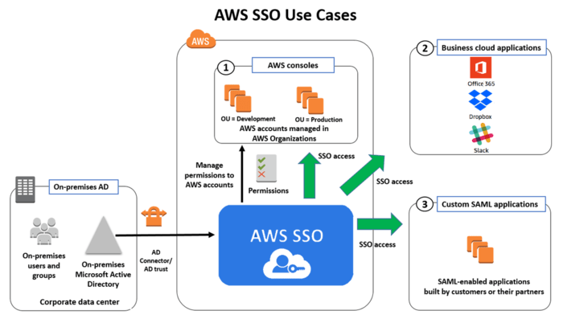
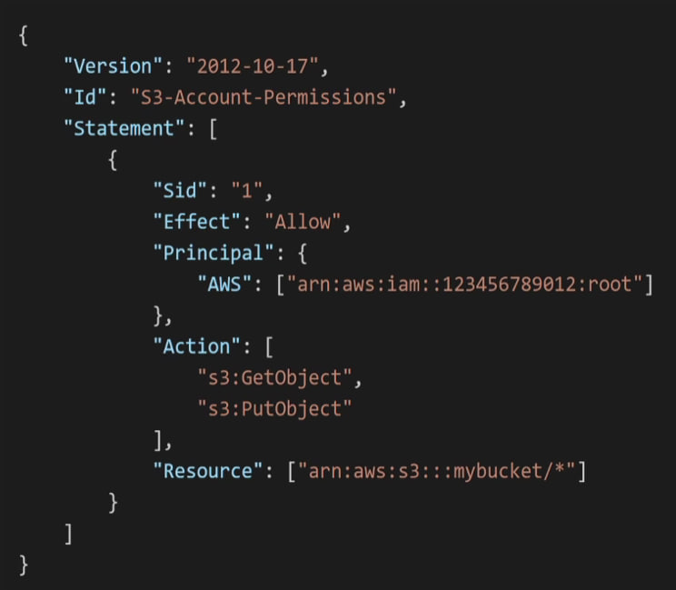
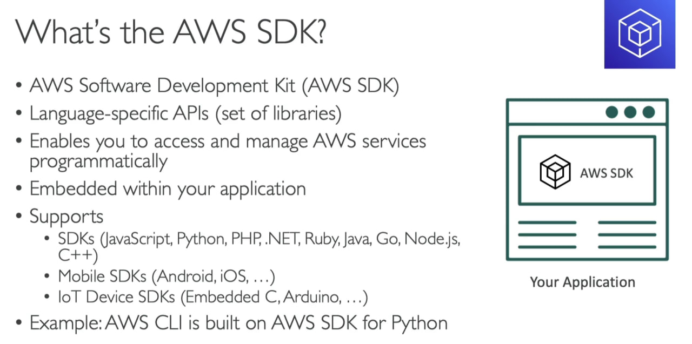
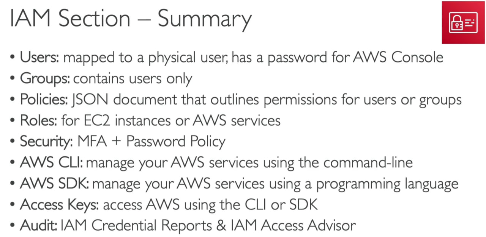

# IAM

## Identity and Access Management
Имеет следующие объекты:
- **Root account**: создается по умолчанию, не должен использоваться или передаваться.
- **Users**
- **Groups**: содержит пользователей

**IAM** - нужен для доступа в аккаунт или с его помощью можно указать, кто или что может получить доступ к сервисам и ресурсам AWS. 

:::info

**IAM vs SSO?** - **SSO** настраивает **SAML** провайдера и роль в **IAM** в аккаунте.
**SSO** использует API-интерфейс `sts:AssumeRoleWithSAML`, а затем, приняв другие роли после этого, будет использовать API-интерфейс sts:AssumeRole.

Единый вход в систему (**SSO**) – это решение для аутентификации, которое дает пользователям возможность входить в несколько приложений и на несколько веб-сайтов с использованием единовременной аутентификации пользователя. Учитывая то, что сегодня пользователи часто входят в приложения непосредственно из своих браузеров, организации создают стратегии управления доступом с различными приоритетами, которые как повышают безопасность, так и улучшают взаимодействие с пользователем. **SSO** реализует оба этих аспекта, поскольку пользователи могут получать доступ ко всем ресурсам, защищенным паролями, без повторного входа в систему, поскольку личность уже установлена.

*Security Assertion Markup Language* (Язык разметки декларации безопасности) - **SAML** - это стандарт **XML** для обмена информацией для единой регистрации между провайдером идентификации, который подтверждает идентификатор пользователя, и провайдером услуг, который использует информацию об идентификаторе пользователя. 

:::



## Users и Groups 
Могут быть заасайнены в **Policy**, что представляет из себя **JSON** документ. В **Statement** полиси **IAM** входят: 
- "**Effect**": `"Allow"`,
- "**Action**":  `["cloudwatch:Describe*", "cloudwatch:ListMetrics"]`,  
- "**Resource**": `"*"`
^^тут указывается, что юзерам или группам можно делать
Нельзя указывать полный доступ на все для всех. "Не давай пользователю больше прав, чем он нуждается"

## IAM Policy 

**IAM Policy** определяет доступы для таких объектов, как Users, Groups и Roles, или ресурс в AWS.

Cостоит из:
- "**Version**" - language version, always include `"2012-10-17"`
- "**Id**" (optional)
- "**Statement**" (required):
    - "**Sid**" - `statement Id`
    - "**Effect**" - `Allow` or `Deny` access
    - "**Principal**" - `account/user/role` to which this policy applied to: "AWS": `["arn:aws:iam::123456789012:root"]`
    - "**Action**" - список Actions: `"s3:GetObject"`, `"s3:PutObject"`, что можно или нельзя в зависимости от **"Effect"**
    - "**Resource**" - список ресурсов, где будет применятся полиси: `["arn"aws"s3:::mybucket/*"]`
    - "**Condition**" (optional) - условие, при котором полиси будет работать



## IAM Roles
Можем выбрать для AWS Service, AWS Account, Web Identity, SAML 2.0 federation, Custom trust policy. Роль дает право делать что-то на AWS. При создании, к **IAM Role** прикрепляется **IAM Policy**
`"Action": "sts:AssumeRole"`,
`"Principal": { "Service": "ec2.amazonaws.com" }` - эту роль может взять на себя сервис EC2.

## Inline Policy
Доступ назначается напрямую пользователю. Если пользователь был удален, то и политика удаляется.

## Password Policy
Можно создать Password Policy (Account Settings), в котором указать условия для пароля пользователей. Есть дефолтное полиси с минимальной длиной пароля и можно создать кастомную.
Также есть MFA - Multi Factor Authentication - генерирует токен, код на внешнем устройстве, которым вы владеете, для подтверждения входа.
Доступные MFA в AWS:
- Google Authenticator (phone only)
- Authy (multi-device)
- Universal 2nd Factor (U2F) Security Key - YubiKey
- Hardware Key Fob MFA Device
- Hardware Key Fob MFA Device for AWS GovCloud (US) - Government

К AWS аккаунту есть два способа иметь доступ:
- AWS Management Console: password + MFA
- AWS Command Line Interface: access keys
- AWS Software Developer Kit: access keys - всякий раз, когда вы хотите вызвать API из AWS из кода вашего приложения

Access keys генерируются в AWS Management Console и можно создать для своего юзера свои access keys:
- Access Key ID ~= username
- Secret Access Key ~= password

## AWS CLI
```bash
aws configure
```

```bash
aws eks update-kubconfig —region us-west-2 —name StudyCluster
```

```bash
aws s3 cp s3://bucket-name
```

https://www.bluematador.com/learn/aws-cli-cheatsheet

## AWS SDK


## Summary
