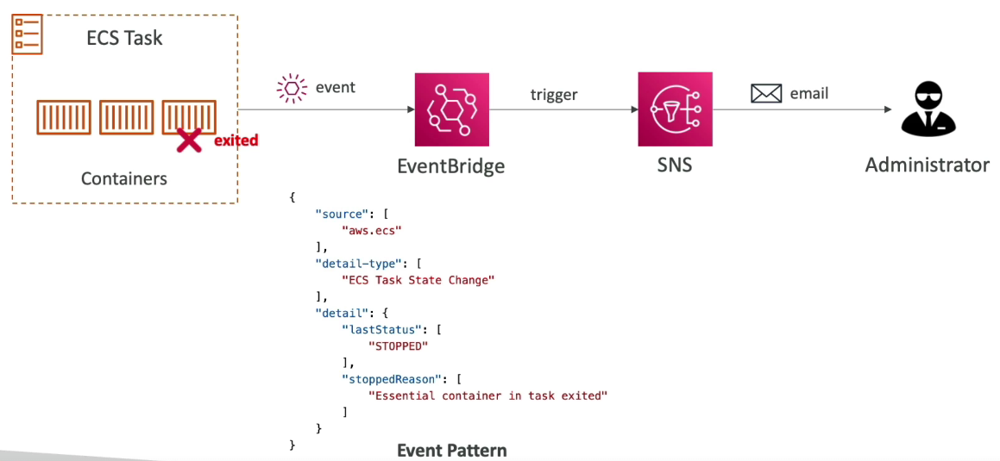

# Containers Management
[Docker Concepts](https://andreasblaze.github.io/docker/concepts)

## ECS
**ECS** (*Elastic Container Service*) — это полностью управляемый сервис оркестрации контейнеров, который помогает легко развертывать контейнерные приложения, управлять ими и масштабировать их. Он интегрирован с **ECR** и **Docker**. Такая интеграция позволяет командам сосредоточиться на создании приложений, а не среды.

### ECS Launch Type
Запуск `Docker Containers` в AWS подразумевает под собой запуск `ECS Tasks` в `ECS Clusters`.

- **EC2 Launch Type**: Необходимо обеспечивать и поддерживать инфраструктуру в виде **EC2** инстансов. Каждый **EC2** инстанс должен запустить `ECS Agent` для регистрации в `ECS Cluster`. **AWS** сам останавливает или запускает контейнеры на **EC2** инстансах.
- **Fargate Launch Type**: НЕ НУЖНО обеспечивать и поддерживать инфраструктуру в виде **EC2** инстансов - используется подход `Serverless`. Нам нужно создать объект `Task Definition`, чтобы определить наши `ECS Tasks`. Чтобы отскейлить это дело - нужно увеличить количество `ECS Tasks`.

### IAM Roles for ECS
В случае с **EC2 Launch Type** нам надо создать `EC2 Instance Profile`, который будет использоваться `ECS Agent` для выполнения **API** вызовов к **ECS** сервису для операций с инстансом, для отправки логов контейнера в **CloudWatch**, для выполнения `docker pull` в реестр образов **ECR**, ссылаться на конфиденциальные данные в **Secrets Manager** или **SSM Parameter Store**. 

Наши `ECS Tasks` получат статус `ECS Task Roles`. Каждая роль создается для конкретного **ECS** сервиса, что мы запускаем. `ECS Task Roles` определяются в `Task Definition`.

### Load Balancer Integrations
**ALB** поддерживается и может использоваться для большинства задач, по типу вывести `ECS Tasks` в виде HTTP/HTTPS эндпоинтов и **ALB** будет перед ними и пользователи будут заходить сначала на него.

**ELB** рекомендуется использоваться только в случаях высокого траффика на эндпоинты или для совмещения с **AWS Private Link**.

### Data Volumes (EFS)
Допустим, мы хотим примонтировать **EFS** на `ECS Tasks`, чтобы шерить какие-то данные. Вот для этого подходит файловая система **EFS** как для **EC2 Launch Type**, так и для **Fargate Launch Type**.

### ECS Service Auto Scaling
Можно настроить автоматическое увеличение или уменьшение желаемого (*desired*) количества `ECS Tasks`. Для этого используется сервис `Application Auto Scaling`. Используя `Application Auto Scaling` мы можем масштабировать `Average CPU Utilization`, `Average Memory Utilization`, `ALB Count Per Target`.

Можно установить разные виды **Auto Scaling**:
- **Target Tracking**: чтобы отслеживать определенные таргеты по `Average CPU Utilization`, `Average Memory Utilization`, `ALB Count Per Target`.
- **Step Scaling**: масштабирование взависимости от сработанного **CloudWatch** алярма.
- **Scheduled Scaling**: масштабирование взависимости от определенной даты или/и времени.

**ECS Service Auto Scaling** (task level) != **EC2 Auto Scaling** (EC2 instance level).

**Fargate Auto Scaling** намного проще настраивать из-за того, шо оно `Serverless`.

**ECS Cluster Capacity Provider** используется для автоматического управления и масштабирования  инфраструктуры `ECS Tasks`, автоматически скейлит **EC2** `ASG`. **Capacity Provider** работает в связке с `ASG`. Рекомендуется использовать для **EC2 Launch Type**.

### Solutions Architectures

> Суть этой архитектуры состоит в том, что `ECS Tasks` вызваны `EventBridge`. Внутри `VPC` есть `ECS Cluster`: **Fargate Launch Type**. В том же регионе у нас есть `S3 Buckets`, куда пользователи будут загружать свои объекты. Эти `S3 Buckets` могут быть интегрированы с `EventBridge`, чтобы отсылать ивенты. В `EventBridge` есть правило "Run ECS Task" и `EventBridge` запустит `ECS Tasks`. Суть задачи будет в получении объектов, их обработке и отправке результатов в `DynamoDB`.

> Тут есть `ECS Cluster`: **Fargate Launch Type** и шедульная рула на `EventBridge`, которая триггерится каждый час и запускает `ECS Tasks`. Контейнеры будут выполнять пакетную (*Batch*) обработку некоторых файлов в `S3`.

> Тут у нас есть `Service A` на `ECS` с двумя `ECS Tasks`. Сообщения будут приходить на `SQS Queue`. И `Service A` опрашивает сообщения из `SQS Queue` и обрабатывает их. Мы можем включить `ECS Service Auto Scaling` поверх `Service A` (чем больше будет очередей в `SQS Queue`, тем больше будет `ECS Tasks`). 

> Тут подразумевается событие, когда `ECS Task` находится в статусе **Exited** и это нежелаемое для нас событие, то мы отслеживаем это событие с помощью `EventBridge` и далее триггерим через `SNS Topic` алерт на администратора (нас).

## ECR
**ECR** (*Elastic Container Registry*) — это служба реестра образов контейнеров, управляемая AWS, безопасная, масштабируемая и надежная. **ECR** поддерживает приватные репозитории с разрешениями на основе ресурсов с помощью **IAM**. Это сделано для того, чтобы определенные пользователи или **EC2** инстансы могли получить доступ к репозиториям контейнеров и образам. Вы можете использовать предпочитаемый интерфейс командной строки для отправки, извлечения и управления образами **Docker**, **OCI** *(Open Container Initiative)* и артефактами, совместимыми с **OCI**.

**ECR** использует для хранения образов **S3**. Поддерживает скан на уязвимости, версионирование, теги для образов и тд...

## EKS
*Elastic Kubernetes Service* используется для управления `Kubernetes Clusters` в AWS. Цель такая же как и у *Elastic Container Service*, но разные API (**ECS** non Open Source, **Kubernetes** is Open Source). 
- Если вы уже встроены в экосистему AWS и вам требуется простое интегрированное решение для управления контейнерами, то **ECS** станет лучшим выбором. Полная интеграция с другими сервисами AWS, автоматическая масштабируемость, надежные функции безопасности и простая модель ценообразования делают его отличным выбором для предприятий любого размера.
- Однако если вам требуется гибкость для запуска приложений как *on-premises*, так и в облаке, а также есть ресурсы и опыт для управления более сложной системой - **EKS** может подойти лучше. Он предлагает больший контроль над вашими приложениями, надежные функции безопасности и может быть экономически эффективным для крупномасштабных приложений.

**EKS** поддерживает два вида `Launch Modes`:
- **EC2 Launch Mode**: если есть необходимость в деплое `Worker Nodes` в качестве **EC2** инстансов;
- **Fargate Launch Mode**: если мы хотим видеть `Serverless` контейнеры у себя в `EKS Cluster`.

:::info
K8s Pod = ECS Task.

Если нужно заэкспоузить (выставить) `EKS Service/Kubernetis Service`, то нужно настроить `Private Load Balancer` или `Private Load Balancer` для коммуникации с Web.
:::

### Node Types
`Kubernetes Node` — это машина, на которой ранятся контейнеризированные приложения (`Pods`). Каждый узел имеет следующие компоненты:
- **Container runtime** — ПО, отвечающее за запуск контейнеров (*Docker Engine*, *containerd*).
- **kubelet** — проверяет работоспособность контейнеров и их работу в связанном поде.
- **kube-proxy** — поддерживает сетевые правила, которые разрешают связь с вашими модулями.

В `EKS Cluster` можно шедулить поды в любой комбинации: 
- **Self-Managed Nodes**: ноды создаются вручную нами (`EC2`, есть поддержка `On-Demand` или `Spot` инстансов), регистрируются в кластере нами и управляются `ASG`; можно использовать кастомные `AMI`.
- **EKS Managed Node Groups**: автоматическое создание и управление нодами (`EC2`, есть поддержка `On-Demand` или `Spot` инстансов), которые будут частью `ASG` (*управляемой EKS*).  
- **AWS Fargate**: нам тут не надо управлять нодами и их мейтенить.

### Data Volumes
Можно приатачить дополнительное хранилище к `EKS Cluster`. Для этого нужно указать `StorageClass` манифест и заранить **CSI** (*Container Storage Interface*) (драйвер).
:::info
Для типа **AWS Fargate** подходит Amazon **EFS**. `EFS volume` может использоваться разными **EC2** инстансами и разными `ECS Tasks`. Его можно использовать в качестве постоянного общего хранилища для ваших контейнеров в нескольких **AZ**.
:::

## AWS App Runner
Полностью управляемый сервис, который помогает деплоить веб-приложения и API едпоинты. С нашей стороны есть только сорс код или докер образ, а далее идет автоматическая сборка и деплой приложения. Нужно только настроить `vCPU`, `RAM`, `Auto Scaling`, `Health Check's` для приложения.