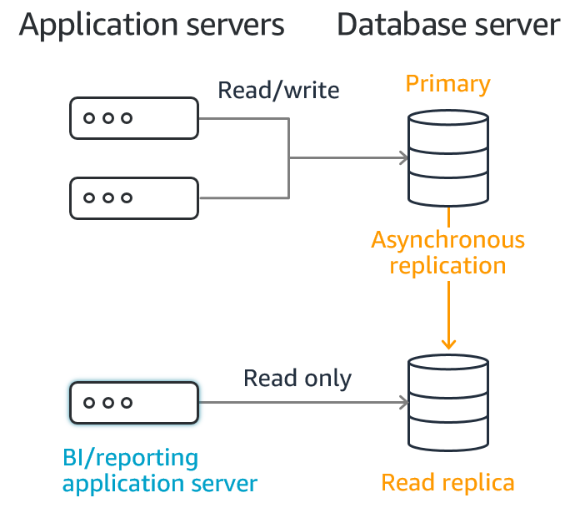

# Databases

## Relational Database Service (RDS)
Это managed Database сервис для баз данных, что используют SQL в качестве языка запросов, то есть в реляционных баз данных — это тип базы данных, в которой данные организованы в строки и столбцы, которые вместе образуют таблицу, в которой точки данных связаны друг с другом. В таких базах данных используется Structured Query Language (**SQL**).

**NoSQL** databases используют JSON (JavaScript Object Notation), XML, YAML, или двоичные схемы, обеспечивающие неструктурированные данные. В таких схемах использется подход ключ-значение. Для подхода использования базы данных **NoSQL** - в AWS есть сервис **DynamoDB** - это serverless, NoSQL database service, в котором ты платишь только за использование конкретных запросов к ней, а в остальное время она скейлится в 0.

:::info

В **RDS** можно создать такие базы данных как: `Postgres`, `MySQL`, `MariaDB`, `Microsoft SQL Server`, `IBM DB2`, `Aurora` (AWS Proprietary database).

Преимущество использования **RDS** вместо самостоятельного развертывания на **EC2** состоит в том, что нам не надо самостоятельно развертывать базу данных, ее обновлять, патчить, следить за ее состоянием, бекапить - это все будет производится на стороне AWS. **Мы даже не сможем подключиться по SSH и нстансам баз данных.**
> Но есть такое понятие как **RDS Custom**, которое распространяется на **Managed Oracle** и **Microsoft SQL Server Database**. Это понятие подразумивает возможность настройки **SSH** соединения, конфигурировать настройки, устанавливать патчи - лучше все эти настройки выполнять при отключеном режиме **RDS Automation** и сделать снепшот.

:::

### Storage Auto Scaling
Функция RDS, что позволяет увеличить место на базе данных динамично. То есть, если заканчивается свободное место на БД, то SAS автоматом накибывает больше памяти. Но для этого нужно установить Maximum Storage Threshold (максимальный лимит для пространства БД).

Также можно настроить автоматику на: 
- Free storage is less than 10% of allocated storage;
- Low-storage lasts at 5 minutes;
- 6 hours have passed since last modification.

### RDS Read Replicas vs Multi AZ
**RDS Read Replicas** обеспечивает повышенную производительность и надежность **RDS**, производя масштабируемость за пределы ограничений емкости одного инстанса БД для рабочих нагрузок базы данных с большим объемом операций чтения.

И мы можем создать до 15 таких **READ** реплик, внутри одной AZ, Cross AZ или Cross Region. Репликация является **ASYNC** (процесс работает независимо от других процессов, тогда как синхронная работа означает, что процесс запускается только в результате завершения или передачи какого-либо другого процесса), поэтому операции чтения в конечном итоге согласованы. Реплики могут быть повышены до собственных БД.

Приложения должны обновлять **connection string**, чтобы использовать **READ** реплики и использовать запросы под только под **SELECT** (INSERT, UPDATE, DELETE - недоступны в данном случае).

Use Case:
> У нас есть приложение и база данных с нормальной нагрузкой и все ок, но тут к нам постучались бизнес аналитики и сказали, что теперь будут генерировать отчеты, используя базу данных. Для БД - это будет уже не ок нагрузка. Чтобы предотвратить проблемы с БД можно использовать READ реплику для приложения по генерации отчетов.

:::info

Обычно в AWS ты платишь за отправку данных из одной AZ в другую, но есть исключения, которые, в основном, работают для AWS-manage сервисов. Для **RDS** не нужно платить за репликацию внутри региона. За `Cross-Region` придется платить.

:::

### Multi-AZ (Disaster Recovery)
Это когда мы реплицируем **RDS Master DB** инстанс синхронно (`SYNC` replication) в другую AZ от AZ мастер БД. Выглядит это так, что у мастер БД и резервной (`standby`) БД есть один DNS name и в случае проблем с мастер БД - произойдет автоматический фейловер к резервной БД. При создании Multi-AZ делается снепшот мастер БД и восстанавливается на резервной БД, после чего начинается процесс синхронизации с мастер БД.

Данный подход используется для фейловера мастер БД, не для скейлинга.

## Amazon Aurora
СУБД от Amazon, не open-source решение. Имеет совместимость с Postgres и MySQL. Лучше всем оптимизирована под AWS, что дает ей 5х прирост в производительности по сравнению с MySQL и 3х с Postgres на RDS.
Также есть плюшка 6 копиях наших данных среди 3-х AZ (4 копии из 6 для записи, 3 копии из 6 для чтения, self healing with peer-to-peer replication + Shared storage Volume). Быстрый фейловер в 30 секунд. Поддерживает Cross Region Replication. Имеет более обширный мониторинг из коробки.

### Aurora DB Cluster
Есть мастер БД с DNS 'Writer Endpoint - Pointing to the master' (чтобы при фейловере приложения продолжали запись), что записывает в Shared storage Volu,e (Auto Expanding from 10G to 128TB). Есть коллекция рид реплик, что находятся под Auto Scaling с общим DNS 'Reader Endpoint - Connection Load Balancing', чтобы приложения не теряли связь с рид репликами.

Можно назначать Custom Endpoint на рид реплики, если тип реплик отличается.

## ElastiCache
