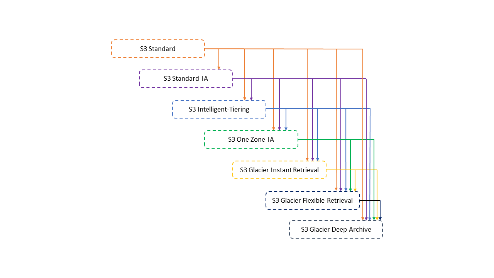

# S3
## Simple Storage Service
Object storage service или сервис хранения объектов, который можно бескочечно масштабировать.
### Use cases
- Backup and storage;
- Disaster Recovery (при перемещении данных в другой регион);
- Archive;
- Hybrid Cloud storage (при имении хранилища на собственных серверах, но не хочется расширять их в облако);
- Application hosting;
- Media hosting;
- Data lakes & big data analytics;
- Software delivery;
- Static website.

## Buckets
S3 позволяет хранить объекты (файлы) в "бакетах" (директориях). Бакеты определяются на уровне региона.
:::caution

Бакеты должны иметь **globally unique name** (среди всех регионов и всех аккаунтов).

:::

## Objects
Объекты (файлы) имееют ключ (`Key`) - Full path of the file:
* s3://my-bucket - `Top-level directory`
* /my_folder_1/another_folder/file.txt - `Key`
  * /my_folder_1/another_folder - `Prefix`
  * /file.txt - `Object name`

Также `Object` имеет `Metadata`, `Tags`, `Version ID`.
:::info

Max `Object` size is `5TB` (5000 GB) - это за один раз, но можно порционно выгружать большие файлы с помощью функции `multi-part upload`.

:::

## Security 
Из базового - это `User-Based`, где указывается `IAM Policy` - какие API вызовы будут доступны конкретному пользователю.

`Resource-Based` - это `Bucket Policies`, где указываются правила напрямую из S3 консоли. Также в `Resource-Based` входит Object/Bucket Access Control List (`ACL`) - безопасность такая.
### Bucket Policies
Это JSON-based полиси:
```json
{
  "Version": "2012-10-17",
  "Statement": [
    {
      "Sid": "statement1",
      "Effect": "Allow",
      "Principal": {
        "AWS": "arn:aws:iam::123456789012:user/Dave"
      },
      "Action": [
        "s3:GetObjectVersion",
        "s3:GetBucketAcl"
      ],
      "Resource": [
        "arn:aws:s3:::DOC-EXAMPLE-BUCKET1",
	 	"arn:aws:s3:::DOC-EXAMPLE-BUCKET1/*"
      ]
    },
    {
      "Sid": "statement2",
      "Effect": "Deny",
      "Principal": {
        "AWS": "arn:aws:iam::123456789012:user/Dave"
      },
      "Action": [
        "s3:DeleteObject",
        "s3:DeleteObjectVersion",
        "s3:PutLifecycleConfiguration"
      ],
      "Resource": [
        "arn:aws:s3:::DOC-EXAMPLE-BUCKET1",
	    "arn:aws:s3:::DOC-EXAMPLE-BUCKET1/*"
      ]
    }
  ]
}

// Мы явно отказали пользователю Dave в разрешении DELETE Object. Явный отказ всегда заменяет любое другое предоставленное разрешение.
```
Чтобы явно запретить пользователям или учетным записям удалять объекты, необходимо добавить в политику корзины следующие действия: разрешения `s3:DeleteObject`, `s3:DeleteObjectVersion` и `s3:PutLifecycleConfiguration`. Все три действия необходимы, поскольку вы можете удалять объекты либо путем явного вызова **DELETE Object API**, либо путем настройки их жизненного цикла (см. Управление жизненным циклом хранилища), чтобы Amazon S3 мог удалять объекты по истечении срока их жизни.

## Static Website Hosting
Для этого надо перевести бакет в режим `Public`, а также подрубить функцию `Static Website Hosting`, где также указываем `index.html` и `error.html` (можно еще `Redirection rules`, но это опционально).

## Versioning
Эту фичу также надо отдельно активировать на уровне бакета. Фича дает возможноть версионирования файлов, то есть хранение одного и того же файла, но с разными `Version ID` который перезаписывает старую версию. Старые версии можно восстанавливать.

## Replication
Это процесс, под которым понимается копирование данных из одного источника на другой (или на множество других) и наоборот.`Versioning` must be enabled on both the source and destination buckets.

Бакеты могут быть в разных AWS аккаунтах, копирование происходит асинхронно (in the background).

### Cross-Region Replication (CRR)
Используются два разных региона. Доступ с меньшей задержкой.

### Same-Region Replication (SRR)
Используются один и тот же регион. Подходит для агрегации логов или при репликации между продакшеном и тестовім аккаунтами вживую.

## Storage Classes
Durability and Availability (долговечность и доступность):
- **Durability** показывает статистику потери объекта в **S3**. Естественно, у Амазона этот показатель очень высокий - шанс потери объекта очень мал. Одинаков для всех `Storage Classes`.
- **Availability** измеряет, насколько доступный сервис. Зависит от `Storage Classes`.

### S3 Standard - General purpose
Подходит для BigData аналитики, мобильных или игровых приложений, дистрибуции контента и тд.
- 99.99% Availability;
- Используется для частого доступа к данным;
- Низная задержка и высокая пропускная способность;
- Устранение двух одновременных сбоев объектов.

### S3 Infrequent Access
`S3 Standard-IA` предназначен для данных, к которым доступ осуществляется реже, но при необходимости требуется быстрый доступ - это стоит дешевле, чем `S3 Standard`. Подходит под бекапы или для *Disaster Recovery*, имеет 99,9% Availability.

Есть еще `One Zone-Infrequent Access (S3 One Zone-IA)`, который имеет `99,9% Durability` в одной **AZ**, `99,5% Availability` и данные умирают если **AZ** умерло. Подходит для второстепенных бекапов или данных, которые вы сможете пересоздать.

### S3 Glacier
S3 Glacier — это безопасный, надежный и недорогой класс хранилища для архивирования данных.

- **S3 Glacier Instant Retrieval**: класс архивного хранилища, обеспечивающий самое дешевое хранилище для долгоживущих данных, доступ к которым осуществляется редко и требующих извлечения за миллисекунды;
- **S3 Glacier Flexible Retrieval**: обеспечивает надежность данных на уровне 99,999999999% (11 девяток) и доступность на уровне 99,99% за счет избыточного хранения данных в нескольких физически разделенных зонах доступности AWS в течение определенного года;
- **S3 Glacier Deep Archive**: обеспечивает самое дешевое хранилище, стоимость которого до 75 % ниже (по сравнению с S3 Glacier Flexible Retrival), для долгоживущих архивных данных, доступ к которым осуществляется реже одного раза в год и которые извлекаются асинхронно.

### S3 Intelligent-Tiering
Обеспечивает автоматическую экономию затрат на хранение данных на трех уровнях доступа с малой задержкой и высокой пропускной способностью. За небольшую ежемесячную плату за мониторинг и автоматизацию объектов S3 Intelligent-Tiering отслеживает шаблоны доступа и автоматически перемещает объекты, к которым не было доступа, на более дешевые уровни доступа.

## S3 Moving Between Storage Classes


### Lifecycle Rules
Можно добавить правила в `S3 Lifecycle configuration`, чтобы указать Amazon S3 на необходимость перевода объектов в другой класс хранилища Amazon S3.
#### Некоторые примеры использования `S3 Lifecycle configuration` таким образом включают следующее:

  - Если вы знаете, что к объектам обращаются нечасто, вы можете перевести их в класс хранения **S3 Standard-IA**;
  - Возможно, вы захотите заархивировать объекты, к которым вам не нужен доступ в режиме реального времени, в класс хранилища **S3 Glacier Flexible Retrival**.

`Transition Actions` - настройка объектов для перехода в другой класс хранения. Например: перенести объекты в класс **S3 Standard-IA** через 60 дней после создания или переместить в класс **Glacier** для архивации после 6 месяцев.

`Expiration actions` - настройка объектов для истекания (удаления) через некоторое время. Наример: *Access log files* (где фиксируются все события, связанные с клиентскими приложениями и доступом пользователей к ресурсу на хосте) могут быть настроены на удаление после истечения 365 дней или настроить удаление старых версий файлов. Можно настроить для удаления незагрузившихся `Multi-Part uploads`.
:::info
Правила создаются для конкретного префикса (*s3://mybucket/mp3/* *) либо для конкретного тега объекта (*Department: Finance*).
:::

### S3 Analytics
Это сервис, собирающий информацию по объектам в бакетах (CSV отчеты) и делающий рекомендации для `Standart` и `Standart IA` классов.

## Requester Pays (Запрашивающая сторона платит)
По дефолту, владельцы бакетов платят за все S3 место и стоимость обмена данными.
Например если кто-то захочет скачать файл с S3, то по дефолту оптала за `Networking Cost` будет на стороне у владельца S3, но можно сделать так, что это будет на стороне `Requester's`.

## Event Notifications
Это `s3:ObjectCreated`, `s3:ObjectRemoved`, `s3:ObjectRestore`, `s3:ObjectReplication`, `s3:LifecycleExpiration`, `s3:LifecycleTransition`, `s3:IntelligentTiering`, `s3:ObjectTagging`, `s3:ObjectAcl` - [Supported event types for SQS, SNS, and Lambda](https://docs.aws.amazon.com/AmazonS3/latest/userguide/notification-how-to-event-types-and-destinations.html#supported-notification-event-types)

Как и много где, для настройки `Event Notifications` нужны `IAM Permissions`. Если мы используем для нотификации **SNS**, то это будет *IAM JSON* - `SNS Resource (Access) Policy`. Тоже надо и для **SQS** и **Lambda**.

С **Amazon EventBridge** сервисом можно по специальным правилам (*JSON rules - metadata, object size, name, ...*) отправлять уведомления к более 18-ти AWS сервисам как к точкам пути назначения.

## Baseline Performance
По умолчанию, S3 автоматически скейлится к высоким показателям запросов, задержка `100-200 милисекунд` - это довольно быстро. Приложение может достигать по меньшей мере `3,500 PUT/COPY/POST/DELETE` или `5,500 GET/HEAD` запросов в секунду для каждого префикса в бакете (директория, шо после корня идет).

### Multi-Part upload
Performance можно оптимизировать функцией `Multi-Part upload` (рекомендуемо для файлов > 100MB и обязательно для файлов > 5GB) - берется один жирный файл, разбивается по частям и параллельно загружается в один объект на S3.

### S3 Transfer Acceleration
Также для оптимизации Performance можно использовать функцию `S3 Transfer Acceleration`, которая повышает скорость передачи путем передачи файла в периферийное местоположение AWS, которое перенаправит данные в S3 бакет в целевом регионе. 
> *Пример*: Мы передаем файл из локации США на S3 бакет в регионе Австралия. Амазон подловит его в своей `Edge Location` в США и по приватной сети AWS закинет в S3 бакет, что ускорит процесс.

### S3 Byte-Range Fetches (выборка байтового диапазона)
Распараллеливает GET запрос путем запроса определенных диапазонов байтов, что уменьшает скорость загрузки.

## Select & Glacier Select
Получайте меньше данных с помощью SQL, выполняя фильтрацию на стороне сервера. Отфильтровать можно по строкам и колонкам (база SQL). Такой подход `S3 Select` позволяет уменьшить передачу по сети и уменьшить стоимость CPU на стороне клиента.

## Batch Operations
Эта фича дает возможность выполнения `Bulk Operations` на существующих S3 объектах с одним запросом. Таким образом можно изменять все метаданные объекта и характеристики, теги, копировать объекты меджу S3 бакетами или зашифровать все незашифрованные объекты.

С данной фичей можно использовать также `S3 Inventory` для получения листа объектов и `S3 Select` для фильтрации объектов.

## Storage Lens
Это сервис, который помогает понимать, анализировать и оптимизировать хранилище во всей организации AWS. Вместе с этим можно определять аномалии, идентифицировать экономическую эффективность, использовать готовые (*количество объектов, средний размер, кол-во бакетов и тд.*) или создавать свои дашборды и следовать бест практикам.

Есть `Summary Metrics`: общая инфа по количеству всего в S3 хранилище;
Есть `Cost-Optimization Metrics`: дают инфу по управлению и оптимизации S3 хранилища для уменьшения костов;
Есть `Data-Protection Metrics`: дают инфу по фишкам для защите данных, определение не соответствования бест практикам по защите;
Есть `Access-management Metrics`: дают инфу по `S3 Object Ownership`, помогает определять какие настройки используются для бакета;
Есть `Event Metrics`: `Event Notifications` метрики, дают инфу по их настройке;
Есть `Performance Metrics`: предоставляют инфу `для S3 Transfer Acceleration`, как много бакетов включено;
Есть `Activity Metrics`: предоставляют инфу по всем запросам GET, PUT, LIST и тд. по нашему S3 хранилищу;
Есть `Detailed Status Code Metrics`: предоставляют инфу по HTTP статус кодам: 200, 403, 404..

Есть бесплатные и платные метрики:
- Бесплатные доступны для всех, их около 28 штук и хранятся 14 дней;
- Платные это `Activity Metrics`, `Detailed Status Code Metrics` и в формате **Advanced** для `Cost-Optimization Metrics`, `Data-Protection Metrics`. Отдельно доступно `CloudWatch Publishing` (метрики в CW) и `Prefix Aggregation` (хранение метрик на уровне префикса). Данные тут хранятся на протяжении 15 месяцев.