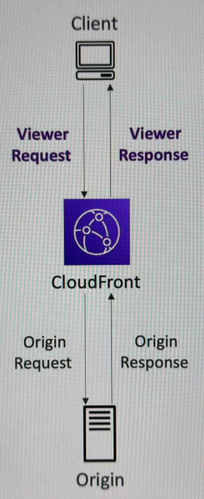
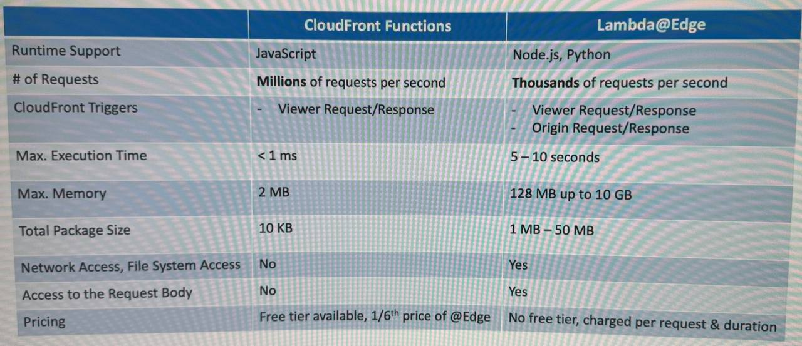
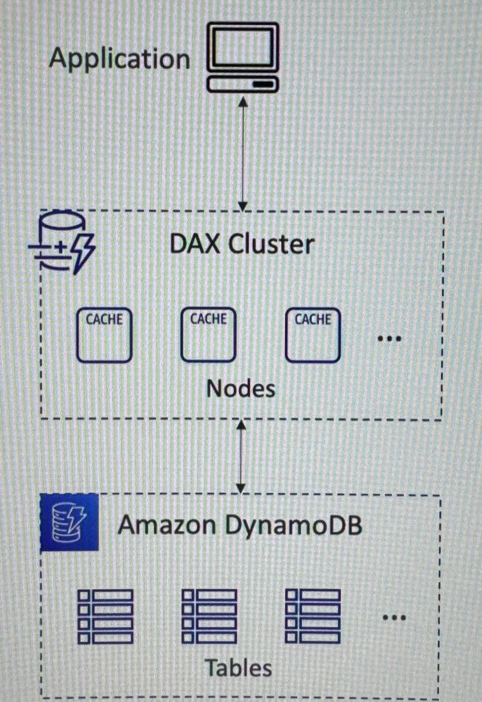

# Serverless
*парадигма, в которой разрабам не надо больше менеджить серваки или **FaaS** (Function as a Service):
- Lambda
- DynamoDB
- Cognito
- API Gateway
- S3
- SNS & SQS
- Kinesis Data Firehose
- Aurora Serverless
- Step Functions
- Fargate

## Lambda
Infra fully managed by AWS. Можно использовать со всем спектром AWS сервисов. Интегрировано множество языков программирования: `Node.js`, `Python`, `Java`, `C#` (.NET Core)/Powershell, `Ruby`, `Rust`, `Golang`. 

*Free tier of `1,000,000` AWS Lambda requests and `400,000GBs` of compute time.*

Платим мы за запрос и за время постраченное на вычисления (как долго отрабатывала Lambda). Доступно до `10Gb` RAM.

Какие существуют интеграции:
- **API Gateway** существует для создания **REST API** и они инициируют нашу **Lambda Function**.
- **Kinesis** использует **Lambda** для трансформации данных на ходу.
- **DynamoDB** использует **Lambda** для создания триггеров на случай, если с базой данных что-то произойдет.
- **S3** может использовать **Lambda** вообще по любому поводу.
- **CloudFront** использует **Lambda** на грани.
- **CloudWatch Events** или **EventBridge** - реагируем с помощью **Lambda** на любые инфраструктурные моменты.
- **CloudWatch Logs** - стрим логов.
- **SNS** - реагирование на нотификации.
- **SQS** для обработки сообщений из очередей.
- **Cognito** для реагирования, например, на логин в базу данных.

Можно настроить вызов **Lambda Function** из **RDS DB Instance** (например, пользователь выполнил INSERT операцию в таблицу). Это возможно для **RDS PostgreSQL** и **Aurora MySQL**.

### Limits
Лимиты распространяются на регион:
- Execution
- - Memory allocation: `128Mb` - `10Gb` (`1Mb` increments)
- - Maximum execution time: `900sec` = `15min`
- - Environment variables (`4Kb`)
- - Disk capacity in the "function container" (in /tmp): `512Mb` to `10Gb`
- - Concurrency executions: `1000` (can be increased)
- Deployment
- - Lambda function deployment size (compressed .zip): `50Mb`
- - Size of uncompressed deployment (code + dependencies): `250Mb`
- - Can use the /tmp directory to load other files at startup
- - Size of environment variables: `4Kb`

:::caution
**Lambda**'s maximum execution time is `15 minutes`. You can run your code somewhere else such as an **EC2** instance or use Amazon **ECS**.
:::

### Lambda SnapStart
Улучшает производительность функций в 10 раз без дополнительных затрат для Java 11+. 
> Это происходит за счет состояния **pre-initialized** (функция не инициализируется с нуля). Оно формируется из снепшота памяти и состояния диска инициализированной функции ранее.

### Customization At The Edge
Мы развертываем наши функции и наши приложения в определенном регионе, но иногда, используя, например, **CloudFront**, у нас есть *Edge*-местоположения, которые распространяют наш контент. 
И иногда современным приложениям требуется выполнить некоторую форму логики на **Edge** перед тем, как достичь самого приложения. 
Так что это называется **Edge Functions**, и это фрагмент кода, который вы пишете и который вы прикрепляете к своим дистрибутивам **CloudFront**. 
Идея заключается в том, что вы хотите запускать эти функции близко к пользователям, чтобы минимизировать задержку в некоторых случаях.

И вот выполняет такие приколы **CloudFront Functions** & **Lambda@Edge**:
- Website Security and Privacy
- Dynamic Web Application at the Edge
- Search Engine Optimization (SEO)
- Intelligently Route Across Origins and Data Centers
- Bot Mitigation at the Edge
- Real-time Image Transformation 
- A/B Testing
- User Authentication and Authorization
- User Prioritization
- User Tracking nd Analytics

**CloudFront Functions** used to change Viewer requests and responses.
**Lambda@Edge** used to change **CloudFront** requests and responses (scales to `1000s`).

:::info
**Lambda@Edge** is a feature of **CloudFront** that lets you run code closer to your users, which improves performance and reduces latency.
:::

### Lambda in VPC
По умолчанию, **Lambda Function** запускается вне нашей **VPC** (на стороне AWS), что говорит об отсутствии доступа к ресурсам в нашей **VPC**. Но можно это исправить, запустив **Lambda Function** в **VPC**.
:::info
Чтобы не нагружать **RDS DB Instance** коннекшонами наших **Lambda Functions** - можно использовать **RDS Proxy**. Но стоит помнить, что **RDS Proxy is never publicly accessible**.
:::

## DynamoDB
Полностью управляемая, высокодоступна база данных - **NoSQL**, она и имеет репликацию данных в нескольких **AZ**'s.
- Low cost and auto-scaling capabilities
- No maintenance or patching, always available
- Made of Tables: каждая таблица имеет `Primary Key`, бесконечный набор елементов (`rows`, а каждый `rows` имеет свой `attributes`). Maximum size of and item is `400Kb`.
:::info
In **DynamoDB** you can rapidly evolve schemas.
:::
У **DynamoDB** есть два режима:
- **Provisioned**: выделяются конкретные ресурсы, которые мы используем - такое сложнее скейлить. 
- **On-Demand**: безлимитное использование ресурсов - что дороже, но нет пределов.

:::caution
*Read/Write Capacity Unit* (**RCU**/**WCU**) are decoupled, so you can increase/decrease each value separately.
:::

### DynamoDB Accelerator (DAX)
A fully managed, highly available caching service built for Amazon DynamoDB. DAX delivers up to a 10 times performance improvement—from milliseconds to microseconds—even at millions of requests per second.

Выбирайте **DAX**, если вы в основном используете **DynamoDB** и вам нужна минимально возможная задержка для операций чтения с минимальной сложностью настройки.

:::caution
 **DAX** caches the most frequently used data, thus offloading the heavy reads on hot keys off your DynamoDB table, hence preventing the "`ProvisionedThroughputExceededException`" exception.
:::

Выбирайте **ElastiCache**, если вам нужна большая гибкость, поддержка сложных структур данных или вы используете несколько источников данных.

### DynamoDB Streams
Это упорядоченная по времени последовательность событий, которая записывает все изменения для таблиц **DynamoDB** в режиме, близком к реальному времени. Подобно захвату данных об изменениях, потоки **DynamoDB** состоят из нескольких событий `Insert`, `Update` и `Delete`. Каждая запись имеет уникальный порядковый номер, который используется для упорядочивания.
:::info
**DynamoDB Streams** enable DynamoDB to get a changelog and use that changelog to replicate data across replica tables in other AWS Regions.
:::

### DynamoDB Streams vs Kinesis Streams
**Kinesis Data Analytics** предоставляет мощные возможности обработки и анализа данных в реальном времени. Больше ретеншн (год), меньше лимитов. 

**DynamoDB Streams** уникальным образом отслеживает изменения в таблицах **DynamoDB**, позволяя запускать события и реплицировать данные практически в реальном времени. Ретеншн - сутки.

### Global Tables
Глобальная таблица — это набор из одной или нескольких таблиц-реплик, все из которых принадлежат одному аккаунту AWS. Одна **DynamoDB Global Table** может иметь только одну таблицу-реплику на регион AWS. При наличии нескольких таблиц у вас будет несколько потоков.

### Time To Live (TTL)
Это функция, которая позволяет вам автоматически управлять истечением срока действия элементов в таблице **DynamoDB**. Она упрощает удаление устаревших или неактуальных данных, позволяя вам указывать атрибут временной метки в ваших элементах, указывающий, когда элементы должны истечь.

### Backups for disaster recovery
Можно настроить **PITR** (*Point-In-Time-Recovery*, опционально включено за последние `35` дней) или **On-Demand** - бекапы на длительный ретеншн период (доступно в AWS Backup).

### Integration with S3
**DynamoDB** можно экспортить в **S3** (допустим надо делать какие-то запросы через Amazon Athena) в течении `35` дней. Можно сохранять снепшоты для аудита, например. 

Также доступен импорт из **S3** в **DynamoDB**.

## API Gateway
Эта штука проксирует REST API запросы от клиента к **Lambda Function** и назад.
:::caution
An **Edge-Optimized API Gateway** is best for geographically distributed clients. API requests are routed to the nearest **CloudFront Edge Location** which improves latency. **The API Gateway still lives in one AWS Region**.
:::

## Step Functions
Это визуальный сервис рабочих процессов, который помогает разработчикам использовать сервисы AWS 
для создания распределенных приложений, автоматизации процессов, организации микросервисов и создания конвейеров данных и машинного обучения (ML).

Из функций есть `последовательность`, `параллельность`, `условия`, `таймауты`, `отлавливание ошибок` и еще некоторые. В `условия`, например можно пропихнуть апрув от пользователя.
Можно использовать в связке с `EC2`, `ECS`, `On-premises servers`, `API Gateway`, `SQS queues`, etc...

## Cognito
Это такой сервис, что дает пользователям идентичность, чтобы они могли пользоваться ресурсами.

### User Pools
Используется для создания коллекций пользователей, для управления их разрешениями или для представления различных типов пользователей.
> Позволяет создавать и управлять группами, добавлять пользователей в группы и удалять пользователей из групп.

Можно интегрировать с **API Gateway**(*pass token*) и **Application Load Balancer**(*listeners&rules*).

По факту, **Cognito User Pools** является `Serverless Database` пользователей для веб или мобильного приложения. 
- Простой логин: *Username (or email) / password*
- Password reset
- Email & Phone Number Verification
- MFA
- Federated Identities: userss from Facebook, Google, SAML...

### Identity Pools (Federated Identity)
Предоставляет временные AWS креды пользователям, которые зарегистрировались в их приложении. 
Благодаря этому, они могут иметь доступ к некоторым AWS ресурсам напрямую или через **API Gateway**.

Можно интегрировать с **User Pools** в качестве *Identity Provider*.

- The **IAM Policies** applied to the credentials are defined in **Cognito**.
- Их можно настраивать на основе `user_id` для более точного управления.
- Можно указывать дефолтною `IAM Role` для авторизированных пользователей и для гостей.

## Cognito vs IAM
Подводя итог, можно сказать, что хотя **IAM** и **Cognito** используются для управления идентификацией и контроля доступа, 
**IAM** ориентирован на `контроль доступа к ресурсам AWS` в рамках учетной записи AWS, тогда как **Cognito** ориентирован на `аутентификацию и авторизацию` пользователей для веб- и мобильных приложений.