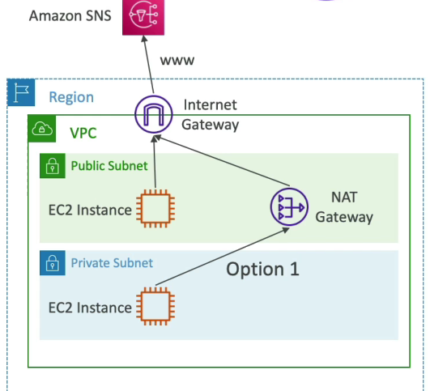

# VPC
## Virtual Private Cloud
С помощью **VPC** можно запускать ресурсы **AWS** в определенной вами логически изолированной виртуальной сети. Эта виртуальная сеть очень похожа на традиционную сеть, которую вы можете использовать в собственном центре обработки данных, с преимуществами использования масштабируемой инфраструктуры **AWS**.
:::info
**VPC** может быть несколько в AWS регионе (максимум 5 на регион, но это софтовое ограничение, так что можно увеличить).
:::

На следующей диаграмме показан пример **VPC**. **VPC** имеет одну подсеть в каждой из `Availability Zones` в `Region`, **EC2** инстансы в каждой подсети и `Internet Gateway`, обеспечивающий связь между ресурсами вашего **VPC** и Интернетом.

VPC Components Diagram:

## CIDR
**Classless Inter-Domain Routing** (*бесклассовая междоменная маршрутизация*) — это метод выделения **IP**-адресов, который повышает эффективность маршрутизации данных в Интернете. Каждая машина, сервер и устройство конечного пользователя, подключающееся к Интернету, имеют связанный с ним уникальный номер, называемый **IP**-адресом. Устройства находят друг друга и взаимодействуют друг с другом, используя эти **IP**-адреса. Организации используют **CIDR** для гибкого и эффективного распределения **IP**-адресов в своих сетях. Вместо классификации **IP**-адреса на основе классов маршрутизаторы получают адрес сети и хоста, указанный суффиксом **CIDR**.

**CIDR** используется в правилах `Security Groups` (как и AWS networking в целом) и помогает определить ренж **IP** адресов. Например, *ww.xx.yy.zz/32* => `1` **IP**, а *0.0.0.0/0* => все **IPs**. Если мы укажем *192.168.0.0/26* - это будет ренж от *192.168.0.0* до *192.168.0.63* (`64` **IP** адреса).

:::note Formula
/28 means 16 IPs (=2^(32-28) = 2^4)
:::

**CIDR** состоит из двух компонентов:
- **Base IP**: базовый IP, типо 10.0.0.0, 192.168.0.0 и тд.
- **Subnet Mask**: определяет сколько можно именить битов в IP (/0, /24, /34).

**Subnet Mask** в основном позволяет части базового **IP**-адреса получать дополнительные следующие значения из базового **IP**-адреса.

:::info
Лимиты по **CIDR**:
- Min size is /28 (16 IP addresses)
- Max size is /16 (65536 IP addresses)
- 5 IP already reserved by AWS
:::
:::caution
Наш **VPC CIDR** не должен пересекаться с другими нашими сетями (корпоративными).
:::

## Public vs Private IP
**IANA** (*Internet Assigned Numbers Authority*) установили определенные блоки адресов **IPv4** для использования частных (**LAN**) и общедоступных (**Интернет**) адресов:
- **Private IP**: 
  - *10.0.0.0* - *10.255.255.255* (**10.0.0.0/8**) 
  - *172.16.0.0* - *172.31.255.255* (**172.16.0.0/12**) AWS default VPC in that range
  - *192.168.0.0* - *192.168.255.255* (**192.168.0.0/16**) home networks
> Так как **VPC** - это приватная сеть, то только `Private IPv4` ренжи могут быть использованы.

Все остальные ренжи являются **публичными**.

## Default VPC Walkthrough
- Все новые AWS аккаунты имеют дефолтную **VPC**. 
- Новые **EC2** инстансы запускаются в дефолтной **VPC** если никакая подсеть не была указана. 
- Дефолтная **VPC** имеет выход в Интернет и все **EC2** инстансы внутри имеют публичные **IPv4**.
- Нам доступны публичные и приватные **IPv4** **DNS** имена.

## Subnets
Подсеть - это такой саб-ренж наших **IPv4** адресов внутри нашего **VPC**.

AWS резервирует 5 **IP** адресов (первые 4 и последний 1) в каждой подсети. Например, если **CIDR** block *10.0.0.0/24*, тогда зарезервируемые **IP** адреса будут следующие:
- *10.0.0.0* - сетевой адрес
- *10.0.0.1* - reserved by AWS, VPC роутер
- *10.0.0.2* - reserved by AWS, для маппинга Amazon-provided DNS
- *10.0.0.3* - reserved by AWS, для дальнейшего использования
- *10.0.0.255* - Network Broadcast Address, хоть AWS в VPC не поддерживает броадкаст, но этот адрес является зарезервированным

## Internet Gateway (IGW)
**IGW** помогает AWS ресурсам, таким как **EC2** инстансам, выходить в Интернет, находясь в **VPC**. Создается отдельно от **VPC**. К одному **IGW** может быть прикреплена одна **VPC** и наоборот. 

По своей сути **IGW** не позволяет выход в Интернет, для этого надо редактировать `Route Tables` так, чтобы тот же **EC2** инстанс мог законнектиться с роутером и потом законнектиться с **IGW**, а оттуда уже законнектиться с Интернетом.

## Bastion Hosts
Хост-бастион – это **EC2** инстанс, который действует как безопасный шлюз для доступа к приватным инстансам в среде **VPC**. Это выделенный сервер, обеспечивающий безопасный доступ к ресурсам приватной сети из-за пределов **VPC**. Хост-бастион часто называют `jump host` или `jump server`, поскольку он используется для перехода из Интернета в приватную сеть.
:::caution
`Bastion Host Security Group` должна иметь разрешающее входящее правило (`allow inbound`) из Интернета на 22-м порту (**SSH**) из ограниченного **CIDR**. Например, публичный **CIDR** компании.

`EC2 Security Group` должны разрешать `Bastion Host Security Group` или приватный IP хоста Бастиона.
:::

## NAT Instances
**NAT** = *Network Address Translation* - технология, позволяющая **EC2** инстансам в приватных сабнетах коннектиться к Интернету - чтобы это сделать, надо поправить `Route Tables` так, чтобы роутить траффик из приватной сабнеты к `NAT Instance`. 

**NAT** инстанс должен быть запущенным в публичной сабнете и иметь `Elastic IP` (**EIP**). 
:::info
`Source/Destination Checking` должно быть отключено на NAT инстансе, так как ему надо отправлять и получать сорс и дистенейшен не его собственный.
:::

## NAT Gateway
`NAT Gateway` - это AWS-managed **NAT** с более высокой пропускной способностью (*from 5 Gbps to 100 Gbps*), высокой доступностью и отсутствием администрирования. Платится за каждый час использования и пропускной способности.

Создается в определенной `Availability Zone` и используется `Elastic IP`.
:::info
Необходим **IGW** (*Internet Gateway*) для роутинга с приватной сабнеты на `NAT Gateway` и потом в Интернет.

No `Security Groups` to manage / required.

1 `NAT Gateway` per 1 `Availability Zone`. Для `Fault-Tolerance` надо делать несколько `NATGW` в нескольких `AZ`.
:::

## Security Groups & NACLs
:::info
`Security group` - это фаервол для **EC2 Instances**. `Security group` является **stateful**: при *inbound* правиле - автоматически создается соответствующее *outbound* правило, автоматически разрешается обратный траффик после установки соединения.

*Network Access Control List* (`NACL`) - это фаервол для **VPC Subnets**. `NACL` является **stateless**: требует явных правил как для *inbound*, так и для *outbound* трафика и каждое правило контролирует либо *inbound*, либо *outbound* трафик, и нет автоматического разрешения обратного трафика, как в **stateful** `Security group`.
:::
`Security Groups` и `NACLs` схожи тем, что позволяют контролировать доступ к ресурсам **AWS** в `VPC`. Но `Security Groups` позволяют контролировать входящий (*inbound*) и исходящий трафик (*outbound*) на уровне EC2 инстанса, тогда как `NACLs` предлагают аналогичные возможности на уровне подсети **VPC**.

### Network Access Control List* (NACL)
**NACL** имеет правила от 1 до 32766, где более высокий приоритет с меньшим номером. Первое совпадение правил будет определять решение:
> Если мы определим `#100 ALLOW 10.0.0.10/32` и `#200 DENY 10.0.0.10/32`, то IP адрес будет разрешен, так как #100 выше по приоритету, чем #200.
:::caution
Новосозданные `NACLs` будут все запрещать по умолчанию.
:::
### Default NACL
Принимает все входящие/исходящие сообщения из подсетей, с которыми он связан.

### Ephemeral Ports
**Ephemeral Ports** или* Эфемерные порты* - это рандомно выбранные порты на ОС для создания запроса, чтобы в пакете, содержащий запрос, был соответствующий параметр про порт для установки соединения.

## VPC Peering
**VPC Peering Connection** — это сетевое соединение между двумя **VPC**, которое позволяет маршрутизировать трафик между ними с использованием приватных адресов IPv4 или IPv6. Инстансы в любом **VPC** могут взаимодействовать друг с другом, как если бы они находились в одной сети.
:::info
В ходе коммуникующих между собой **VPC**'s, стоит назначать разные **CIDR**'s, чтобы не было оверлаппинга.

**VPC Peering Connection** можно создать для **VPC**'s, что находятся в разных аккаунтах или регионах.

Можно использовать `Security group` как референс после пиринга.
:::
:::caution
Нужно обновить `Route Tables` в каждой **VPC** сабнете, чтобы **EC2** инстансы могли коммуницировать между собой.
:::

## VPC Endpoints
**VPC Endpoint** позволяет приватно законнектить **VPC** к поддерживаемым сервисам **AWS** и **VPC Endpoints** сервисам на базе `PrivateLink` без необходимости использования интернет-шлюза, устройства **NAT**, **VPN**-соединения или соединения **AWS Direct Connect**.

> **Пример**: у нас есть публичная сабнета с **NAT Gateway** и **EC2** инстансом для выхода в интернет через **Internet Gateway**, и приватная сабнета с **EC2** инстансом. **EC2** инстанс должен коммуницировать с **AWS SNS** сервисом и для этого ему надо пройти через **NAT Gateway** и **Internet Gateway**, так как необходим публичный доступ. **EC2** инстансу так-то тоже надо идти через **Internet Gateway**, чтобы иметь доступ к **AWS SNS**.

Этот пример имеет право на существование, но его можно оптимизировать с помощью **VPC Endpoints** для уменьшения костов на траффик через **NAT Gateway** и **Internet Gateway**(бесплатно, но есть задержка).

### Types of Endpoints
- **Interface Endpoints** (*powered by PrivateLink*): Предоставляет **ENI** (приватный **IP** адрес) в качестве точки входа. Для этого действия, нам над прикрепить **Security Group**. Кост насчитывается за каждый час + за каждый гигабайт обработанных данных.
- **Gateway Endpoints**: Предоставляет шлюз и это необходимо использовать в качестве таргета в **Route Tables**. Таким образом, это не использует **IP**-адреса, **Security Group**, это просто таргет в **Route Tables**. И для ендпоинта шлюза есть только два таргета: `Amazon S3` и `DynamoDB`, но преимущество что это бесплатно и автоматически масштабируется.
:::info
Для `Amazon S3` и `DynamoDB` лучше заморочиться с **Route Tables** и использовать **Gateway Endpoints**, так как это бесплатно и более ефективно.

Для **Interface Endpoints** требуется ли предпочтительный доступ из on-premises среды (Site-to-Site VPN или DirectConnect), другого VPC или другого региона.
::: 

## VPC Flow Logs
**VPC Flow Logs** - это функция, которая позволяет собирать информацию об входящем и исходящем **IP**-трафике от сетевых интерфейсов в вашем **VPC**. **VPC Flow Logs** можно публиковать в `Amazon CloudWatch Logs`, `Amazon S3` или `Amazon Data Firehose`.

Есть три типа **Flow Logs**:
- **VPC**
- **Subnet**
- **ENI**

## Site-to-Site VPN, Virtual Private Gateway & Customer Gateway

:::caution
Если нужно выполнить ping инстансов **EC2** из среды *on-premises* в AWS, убедитесь, что протокол **ICMP** включен в inbound правило в **Security Group**.
:::
### Site-to-Site VPN
**Site-to-Site VPN** подключает *on-premises* сеть к AWS **VPC** через **VPN**-подключение **IPsec**. Этот тип VPN позволяет вашим ресурсам AWS безопасно взаимодействовать с вашими локальными ресурсами, как если бы они находились в одной сети (безопасное соединение между вашей корпоративной сетью и AWS **VPC**).
:::info
Чтобы настроить **Site-to-Site VPN** между *on-premises* и AWS, нужно сначала создать **Customer Gateway**, потом **Virtual Private Gateway** и связать их в **Site-to-Site VPN**. 
:::

### Virtual Private Gateway (VGW)
**Virtual Private Gateway** — это VPN-концентратор на стороне Amazon **Site-to-Site VPN**. Это ендпоинт вашего **VPN**-соединения на стороне AWS. Когда вы создаете **Site-to-Site VPN**, вы подключаете **Virtual Private Gateway** к своему **VPC**.
> У вас есть **VPC**, где вы размещаете несколько **EC2** инстансов, на которых работают различные приложения. Чтобы подключить этот **VPC** к вашей локальной сети через **VPN**, вы создаете и подключаете **Virtual Private Gateway** к своему **VPC**.

### Customer Gateway (CGW)
**Customer Gateway** — это ресурс, который предоставляет AWS информацию об устройстве клиентского шлюза или программном приложении в вашей локальной сети. По сути, это конфигурация на вашей стороне, которая сообщает AWS настройки вашего **VPN**-устройства.
> В вашем *on-premises* датацентре может быть установлено **VPN**-устройство (например, `Cisco ASA`, `Juniper SRX` или VPN-решение с открытым исходным кодом). При настройке **Site-to-Site VPN** в AWS вы должны создать **Customer Gateway** в AWS, предоставив такие данные, как `общедоступный IP-адрес` вашего **VPN**-устройства и информацию о маршрутизации.

:::info
Таким образом, вы можете использовать **Direct Connect** в качестве вторичного соединения, но это будет довольно дорого. Или вы можете настроить **VPN**-соединение **Site-to-Site** в качестве резервного соединения и настроить его так, чтобы в случае сбоя основного соединения оно сработало, и теперь вы подключаетесь через общедоступный Интернет, используя **VPN**-соединение **Site-to-Site**, что может быть немного надежнее, потому что Интернет, общедоступный Интернет, всегда может быть доступен.
:::

### AWS VPN CloudHub 
Идея состоит в том, что у вас есть **VPC** с вашим **VGW**, и у вас есть несколько клиентских сетей, несколько датацентров, каждый со своим собственным **CGW**. Таким образом, **CloudHub** должен обеспечить безопасную связь между всеми этими сайтами, используя несколько **VPN**-соединений. 

Это недорогая звездообразная модель для первичного или вторичного сетевого подключения между разными местоположениями, но только с использованием **VPN**. Таким образом, вы должны установить межсетьевую **VPN** между **CGW** и одним **VGW** в вашем **VPC**. И затем, благодаря этому соединению, сети ваших клиентов теперь могут взаимодействовать друг с другом через это **VPN**-соединение.

## Direct Connect & Direct Connect Gateway
### Direct Connect (DX) 
**Direct Connect (DX)** дает увеличенную пропускную способность, а это означает, что если вы работаете с большими наборами данных, это будет быстрее, потому что они не проходят через общедоступный Интернет, а также у вас будут меньшие затраты, потому что вы вы используете приватное соединение. 

Кроме того, если у вас возникли проблемы с подключением к общедоступному Интернету, мы воспользуемся **Direct Connect**, чтобы получить более стабильную работу в сети, опять же, потому что она является приватной. Это особенно полезно, если у вас есть приложения, использующие каналы данных в реальном времени. Наконец, он поддерживает гибридные среды, поскольку у вас есть возможность подключения между собственным датацентром и облаком.

- Обеспечивает выделенное приватное соединение из удаленной сети с вашим **VPC**. 
- Между вашим DC и местоположениями AWS `Direct Connect` должно быть установлено выделенное соединение.
- Вам необходимо настроить **Virtual Private Gateway** на вашем **VPC**.
- Доступ к общедоступным ресурсам (**S3**) и частным ресурсам (**EC2**) по одному и тому же соединению.
:::info
Используя соединение **Direct Connect**, вы можете получить доступ как к `Public`, так и к `Private` ресурсам AWS.
:::

### Direct Connect Gateway 
**Direct Connect Gateway** используется, если нужно подключиться к одному или нескольким **VPC** в разных регионах.

> **Пример**: у нас есть два региона, и у них есть два разных **VPC**, у нас есть два разных **CIDR**, и мы хотим подключить наш *on-premises* датацентр к обоим **VPC**. Итак, мы собираемся установить соединение **Direct Connect**, а затем, используя приватный **Virtual Interface**, вы подключите его к **Direct Connect Gateway**. И этот **Direct Connect Gateway** будет иметь приватный **Virtual Interface** с **Virtual Private Gateway** в первом регионе и еще одним во втором регионе. Итак, используя настройку, мы можем начать подключаться к нескольким **VPC** и нескольким регионам.

Connection Types:
- **Dedicated Connections**: 1 Gbps, 10 Gbps и 100 Gbps;
> и мы получаем выделенный для нас физический порт **Ethernet**. И сначала нам нужно сделать запрос в AWS, а затем его выполнит партнер `AWS Direct Connect`. 
- **Hosted Connections**: 50 Mbps, 500 Mbps, да 10 Gbps.
> И снова мы делаем запросы на подключение через партнеров `AWS Direct Connect`. И тогда мы сможем добавлять мощности *on-demand*.
:::info
Установка подобного соединения составляет обычно более одного месяца по времени - это не быстро.
:::

**AWS Direct Connect** можно использовать в связке с VPN для шифрования через протокол **IPsec** траффика. По умолчанию, **AWS Direct Connect** не зашифрован, но приватен.

### Resiliency
Итак, в первом случае у нас есть приватный **Virtual Interface** здесь и здесь есть приватный **Virtual Interface**. Итак, здесь мы получаем одно соединение и несколько мест, и поэтому, если одно из мест **Direct Connect** выходит из строя, то, по крайней мере, у нас есть резервное расположение **Direct Connect** где-то еще, и это дает нам высокую отказоустойчивость, и это хорошо для критических рабочих нагрузок. 

Но если вы хотите добиться **максимальной** отказоустойчивости для критически важных рабочих нагрузок, тогда вам придется снова настроить два местоположения **Direct Connect**, но на этот раз каждое местоположение **Direct Connect** будет иметь два независимых соединения, чтобы обеспечить максимальную отказоустойчивость. Итак, в этом варианте использования у нас есть четыре соединения в двух местах с AWS. Таким образом, максимальная отказоустойчивость достигается за счет использования отдельных соединений, завершающихся на отдельных устройствах в более чем одном месте.

## Transit Gateway
Для создания транзитного пирингового соединение между тысячами **VPC**, нашим *on-premises* датацентром, **VPN** типа «сеть-сеть», прямые соединения в звездообразном соединении `«звезда»`.

- Это региональный ресурс, который может работать в разных регионах, и вы можете использовать свой транзитный шлюз для нескольких учетных записей с помощью `Resource Access Manager`(RAM). 
- Вы также можете использовать пиринговые транзитные шлюзы по всему региону. 
- Нужно создать таблицы маршрутов для вашего транзитного шлюза, чтобы ограничить, какой **VPC** может взаимодействовать с другим, какое соединение имеет доступ друг к другу и так далее. Таким образом, вы получаете полный контроль над маршрутизацией всего трафика внутри транзитного шлюза, что обеспечивает сетевую безопасность. 
- **Transit Gateway** работает с `Direct Connect Gateway` и **VPN**-соединениями.
- Это единственный сервис в AWS, который поддерживает многоадресную рассылку IP (`IP Multicast`). 

Еще один вариант использования **Transit Gateway** — увеличение пропускной способности **VPN**-подключения типа «сеть-сеть» с помощью **ECMP**. **ECMP** означает многопутевую маршрутизацию с равной стоимостью. Это стратегия маршрутизации, позволяющая пересылать пакеты по нескольким лучшим маршрутам. И вариант использования заключается в создании нескольких **VPN**-подключений типа «сеть-сеть» для увеличения пропускной способности вашего подключения к AWS с использованием **VPN** типа «сеть-сеть».
:::info
Вы хотите увеличить пропускную способность VPN-подключения **AWS Site-to-Site**, установленного между *on-premises* и облаком AWS, за пределы максимального предела одного туннеля **IPsec** в 1,25 Гбит/с — используйте **Transit Gateway**.
:::

## VPC Traffic Mirroring
Идея состоит в том, что мы хотим ловить и проверять сетевой трафик в нашей **VPC**, но делать это ненавязчиво. Для этого мы хотим направить трафик на устройства безопасности, которыми мы управляем. И для этого мы собираемся перехватить трафик, поэтому мы собираемся определить, из каких исходных **ENI** мы хотим захватывать трафик. А затем цели, куда мы хотим отправить этот трафик: наши собственные **ENI** или, возможно, `Network Load Balancer`(NLB).

> У нас есть **EC2** и **ENI**. Наш **EC2** подключается к Интернету. Таким образом, мы получаем много входящего и исходящего трафика по **ENI** к **EC2**. Но мы хотели проанализировать наш трафик. Для этого мы собираемся настроить **NLB**, а за этим балансировщиком сетевой нагрузки у нас будет группа автоматического масштабирования (**ASG**) **EC2** инстансов, на которой будет установлено некоторое программное обеспечение безопасности. Теперь мы хотим иметь возможность перехватывать весь трафик из источника `A`, не нарушая работу. Для этого мы собираемся настроить `зеркалирование трафика` **VPC** и, при желании, мы можем установить фильтр, чтобы вы получили только некоторую информацию, а не всю. А благодаря этой функции зеркалирования трафика весь трафик, отправленный в **ENI** или источник `A`, также будет отправлен в наш **NLB**. Отсюда и название нашего **NLB** — зеркалирование трафика. И оттуда мы можем анализировать сам трафик. И это касается не только одного источника, но и нескольких источников. 

Если у вас есть второй **EC2** с другим **ENI**, мы снова можем зеркально отразить трафик в нашем **NLB**. Нам необходимо, чтобы источник и таргет находились в одной **VPC** или в разных **VPC**, и если мы включили `VPC Peering`. Таким образом, варианты использования зеркалирования трафика **VPC** будут связаны с проверкой контента, мониторингом угроз или устранением неполадок с точки зрения сети.

## Egress Gateway
Фича доступная для IPv6 траффика, а именно разрешение на отдачу, но отказ на прием траффика на **EC2** IPv6.

## Networking Costs (per Gb)
- Публичный траффик, который заходит из Интернета в наш **EC2**, обходится нам бесплатно.
- Траффик внутри **AZ** между **EC2** по `Private IP` бесплатен.
- Если нам нужна коммуникация с **EC2** из другой **AZ** и нам надо будет уже использовать `Public IP/Elastic IP` и это будет стоить `$0.02`.
- Если ^эта^ коммуникация будет происходить через `Private IP`, то стоимость будет `$0.01`.
- Траффик между **EC2** в разных регионах будет нам стоить в `$0.02`.

Нужно стараться сохранить как можно больше интернет-трафика в AWS, чтобы минимизировать затраты:

### S3
- Траффик, который идет на **S3** - бесплатен, т.к. это *ingress* траффик.
- Стоимость скачивания данных составляет `$0.09`, т.к. это *egress* траффик.
- Если мы используем **S3 Transfer Acceleration** (ускоряет передачу контента из S3), то это добавит к базе `$0.09` + `$0.04`-`$0.08` за Гб.
- Траффик из **S3** в **CloudFront** - бесплатен. Но из **CloudFront** в Интернет будет стоить `$0.085` за Гб (дешевле, чем **S3**). *Запросы на **CloudFront** в 7 раз дешевле, чем если они совершаются напрямую на **S3**.
- **S3 Cross Region Replication** обойдется в `$0.02` за Гб.

> **Пример**: Есть два **EC2** инстанса в одном регионе, одной **VPC**. Один находится в `Private Subnet 1`, другой в `Private Subnet 2`. Оба должны иметь доступ на операции с **S3**. Тот, что в `Private Subnet 1`, делает это с помощью **NAT Gateway** в `Public subnet` и с доступом в Интернет через `Internet Gateway`. Устанавливаем роутинг через **Route Table** для `Subnet 1`. Другой **EC2** в `Private Subnet 2` делает обращения к **S3** через **VPC Endpoint** приватным образом. Устанавливаем роутинг через **Route Table** для `Subnet 2`. 
:::note Private Subnet 1
- `$0.045` **NAT Gateway** / hour
- `$0.045` за каждый обработанный Гб на **NAT Gateway**
- `$0.09` за отправку данных на **S3** из другого региона и `$0.00` если этот тот же самый регион
:::
:::note Private Subnet 2
- Использование Gateway Endpoint - бесплатное
- `$0.01` за передачу данных in/out для того же региона
:::

## AWS Network Firewall
Это управляемый сетевой фаервол с отслеживанием состояния, а также сервис по обнаружению и предотвращению вторжений для **VPC**. Предотвращение аттак производится от `3`-го слоя **OSI** до `7`-го слоя.
