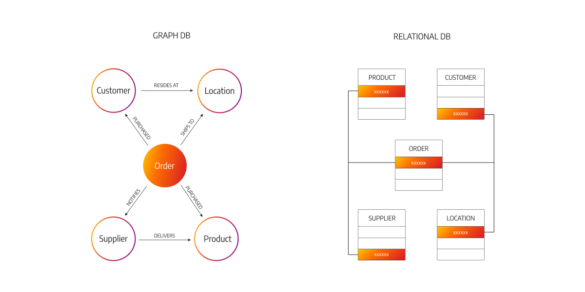
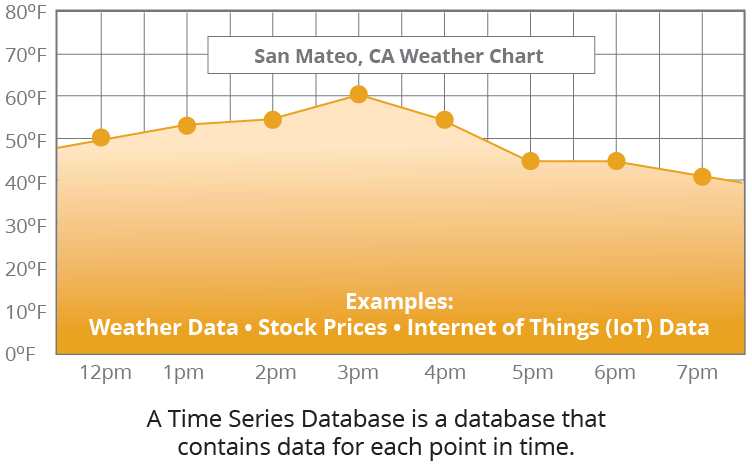

# AWS Database's

## Database Types
- **SQL** (*RDBMS*): RDS, Aurora - great for joins.
- **NoSQL**: DynamoDB (JSON), ElastiCache (key/value), Neptune (graphs), DocumentDB (for MongoDB), Keyspaces (for Apache Cassandra) - no joins, no SQL.
- **Object Store**: S3 (for big objects), Glacier (for backups/archives).
- **Data Warehouse**: Redshift (OLAP), Athena, EMR - SQL Analitics/BI.
- **Search**: OpenSearch (JSON) - free text, unstructured searches.
- **Graphs**: Amazon Neptune - displays relationships between data.
- **Ledger**: Amazon Quantum Ledger Database
- **Time series**: Amazon Timestream

## RDS
So the use cases of Amazon **RDS** is to store relational databases.
> For example, using the RDBMS or have an online transaction processing database, so OLTP. If you wanted to perform SQL queries on top of it and transactions.

- Managed **PostgreSQL** / **MySQL** / **Oracle** / **SQL Server** / **DB2** / **MariaDB** / *Custom*
- Provisioned **RDS Instance** size and **EBS Volume** Type & Size
- Auto-scaling capability for Storadge layer
- Support for **Read Replicas** (to scale read capabilities - analytics and etc.) and for High Availability purposes may use the **Multi-AZ** to have a standby (резервной) database, although that database is just here for in case a disaster strikes. You cannot use it to perform queries against it
- Security through **IAM**, **Secutiry Groups**, **KMS**, **SSL** in transit
> Security for your **RDS** database is done through **IAM**, so you can use, for example, username and password to connect to your database, but also you can use **IAM** authentication, for some of them. You have **Security Groups** for network security on your Amazon **RDS** database. **KMS** for at risk encryption, and you can have intrinsic encryption using **SSL** and **TLS**.
- Automated Backup with Point in time restore feature (up to 35 days)
> If you wanted to do backups, you have the automated backup option, which is up to 35 days, and if you use that, you can do point in time restore to any point of time in these 35 days, and this will create a new database out of it
- Manual DB Snapshot for longer-term recovery
> Or if you want to retain backups for longer term recovery, then you would use a manual database snapshots.
- Managed and Scheduled maintenance (with downtime)
> There is a managed and schedule maintenance, which will bring downtime into your database. So this is due to the fact that you have to provision it and that you have to update. **AWS** has to update at some point database engine or the underlying **EC2** instance for patches of security and so on.
- Support for **IAM** Authentication, integration with Secret Manager
> There is support for **IAM** authentication on **RDS**, and you can enforce it through the **RDS** proxy, and it has integration with **Secrets Manager** to manage the database credentials.
- **RDS** Custom for access to and customize the underlying instance (Oracle & SQL Server)
> If you wanted to have access to the underlying instance and customize it, then you can reuse the **RDS** custom option and this is available for the Oracle and SQL Server type of databases.

## Aurora
Use cases for **Aurora** are the same as **RDS**, but you have less maintenance, more flexibility, more performance, and more features out of the box, which makes **Aurora** a great choice.
- Compatible API for PostgrSQL / MySQL, separation of storage and compute
> **Aurora** is a very special service because storage and compute are separate
- - *Storage*: data is stored in **`6` replicas**, across **`3` AZ** - higly available, self-healing, auto-scaling
> The data is stored in **`6` replicas** across **`3`** **Availability Zones** by default, and you cannot change this, therefore **Aurora** is highly available. On top of it, in case there is any issue with the storage, there's going to be a self-healing process behind the scenes happening. And if you wanted to increase the storage, no problem. There is auto-scaling out of the box.
- - *Compute*: Cluster of **DB Instance** across multiple **AZ**, **auto-scaling** of **Read Replicas**
> For the compute side, this is the actual **Database instances**, they are clustered, and they can be across multiple **Availability Zones** if you wanted to. And then if you had **Read Replicas**, you could auto-scale them as well to increase the capacity in case the load increases.
- - *Cluster*: Custom endpoints for writer and reader **DB instances**
> IF you have a cluster of **Database instances**, then you need custom endpoints to know where to write and read, and therefore you have a writer endpoint and a reader endpoint.
- Same security / monitoring / maintenance features as **RDS**
> **Aurora** has the same security, monitoring, and maintenance features as **RDS** because, end of the day, they use kind of the same engine.
- **Aurora Serverless** - for unpredictable / intermittent workloads (для непредсказуемых/прерывистых рабочих нагрузок), no capacity 
> This is when you have unpredictable and intermittent workloads, but you don't need to do any capacity planning, so it is quite helpful in that use case.
- **Aurora Global**: up to **`16`** **DB Read Instances** in each region, < **`1` second** storage replication
> If you wanted to have a Global Database, you could use **Aurora Global**, and that gives you up to `16` database read instances in each region where your database is replicated. And the storage replication happens in less than `1` seconds usually across regions. And in case you have a problem in your **Primary Region**, you can promote a **Secondary Region** to become your **New Primary**.
- **Aurora Machine Learning**: perform ML using SageMaker & Comprehend on Aurora
- **Aurora Database Cloning**: new cluster from existing one, faster than restoring a snapshot
> If you wanted to use a testing database or a staging database out of your production database, for example, you could use the **Aurora Database Cloning** feature to create a **new Aurora cluster** out of the existing one, and it is much faster than doing a snapshot and restoring it.

## ElastiCache
Use cases for **ElastiCache** are going to be `Key/Value` store, when you do frequent read-on-top of your database, it's good to cache database queries. Also, if you have session data that needs to be stored for your users on your website, **ElastiCache** is also a very good use case. 
:::info
You cannot use **SQL** on **ElastiCache**.
:::
- Managed **Redis** / **Memcached** (similar offering as **RDS**, but for **caches**)
:::info 
Cache is an in-memory data store which gives you sub-millisecond latency when you want to read data.
:::
So for this, you must provision an **ElastiCache instance type** (e.g., cache.m6g.large) for your cache, and then you are good to go.

So if you are using **Redis**, you can have support for **Clustering**, **Multi AZ**, and **Read Replicas** for sharding, and you have security provision through **IAM**, **SG**, **KMS**, **Redis Auth**.

You have the same kind of features as **RDS for backups**, **snapshots**, and **point-in-time restore**. You have **managed** and **scheduled maintenance**. 

If you decide to use Amazon **ElastiCache** to perform some caching on top or combine with an **RDS database**, is that to use **ElastiCache**, you need to modify your application code **to leverage ElastiCache**.
:::caution
**ElastiCache** is not a good choice for a caching solution that does not require a code change.
:::

## DynamoDB
Anytime you see that you need to rapidly evolve schema which have a flexible type of database schema **DynamoDB** is going to be a great choice. So the use cases for **DynamoDB** is when you want a database and do serverless application development and your data are small documents, for example, in the `100s of kilobytes of size maximum` or when you want a **distributed serverless cache**.

**DynamoDB** is a proprietary technology from AWS. It's a managed serverless and **NoSQL database** that provides you out of the box millisecond latency. You have two capacity modes you need to choose from:
1. **Provision Capacity**: with optional auto-scaling, which is great when you have a smooth type of workload that increases gradually over time or decreases gradually over time.
2. **On-demand Capacity**: you don't have to provision capacity, but it scales automatically for you, which is great if you have very unpredictable workloads or if you have sudden steep spikes of demand on your database.

**DynamoDB** can replace **ElasticCache** as a `key-value` store and it's a great way to, for example, store session data for your website, combined with a **TTL** feature to expire a row after a specific amount of time.

**DynamoDB** is highly available. It is across multiple **Availability Zones** by default. The `Reads` and the `Writes` are fully decoupled (полностью развязаны) and it's possible for you to have transactions on top of the **DynamoDB** tables.

It is possible for you to create a **Read Cache** out of the box that is fully compatible with **DynamoDB** which is a **DynamoDB Accelerator (DAX) cluster**, and the particularity of it (особенность этого) is that you get then **microsecond Read Latency**.

In terms of security authentication and authorization, everything is done through **IAM**.

You have **Event Processing capability** on top of **DynamoDB**, so you can enable **DynamoDB Streams** to stream all the changes happening into your database and you can have an integration to invoke **Lambda** from the **DynamoDB Stream**. Therefore, **Lambda** can be invoked for every single change in your **DynamoDB** table.

The other option is instead of standing the data to **DynamoDB Streams**, you can send the data to **Kinesis Data Streams**. The advantage is that on top of it, you can use the **Kinesis Data Firehose feature**, or you can use any type of integration that leverages (использует) **Kinesis Data Stream**. 
- For example, you could have longer term retention up to **`1` year** on **Kinesis data streams**.

You have a **Global Table feature** on top of the **DynamoDB**, which allows you to do `active-active` replication across multiple regions. So anyone can `Read` and `Write` from any region; this is why it's called `active-active`.

### Backup options
You have two backup options:
1. **Automated Backup**: you need to enable **point in time recovery (PITR)** for that and you can restore your table to a new **DynamoDB table** for any point of time up to **`35` days**.
2. **On-Demand Backup**: if you want to have longer term retention of backups, which will also restore to a new table.

You can export your **DynamoDB table** to Amazon **S3** without using any of the `Read Capacity Units` within the **PITR** windows, So within **`35` days** using the export to **S3** feature. And you can also import from **S3** without using any `Write Capacity Units` into a new table.

## S3
**S3** is a key value store for objects. And it's great when you want to store big objects, it's not great to store many small objects. Use cases are around static files.

### Tiers
**S3** is serverless, you have infinite scaling. The maximum object size is **`5` terabytes** and you can version objects over time. You have different **storage tiers**:
- **S3 Standard**
- **S3 Infrequent Access**
- **S3 Intelligent**
- **S3 Glacier**
> and if you want to transition between the tiers you can use lifecycle policies.

### Features
Some important **features** you need to know:
- Versioning
- Encryption
- Replication
- Multifactor Authentication (**MFA**)
- Access Logs

### Security
In terms of security you have: 
- **IAM security** but you can also have **Bucket Policies** on top of your **S3 Buckets**
- **ACL**
- **Access Points**
- **S3 Object Lambda** to modify objects before they are sent to the applications
- **CORS**
- the concept of **Object Lock or Vault Lock** for **Glacier** 

### Encryption
In terms of encryption mechanisms, we have:
- **SSE-S3**
- **SSE-KMS** where you can bring your own KMS key
- **SSE-C**
- **Client-Side** (client site encryption)
- **TLS encryption in transit**
- **Default** encryption scheme

### Batch operations
If you wanted to **operate on all the files** in Amazon **S3 buckets** at a time you can use **S3 Batch** to do batch operations, and this is very helpful, for example, when you want to encrypt unencrypted objects on an existing Amazon **S3 buckets**, or when you want to copy existing files from one bucket to another before enabling **S3 Replication**. And to create this list of files, you can use **S3 Inventory**, for example.

### Performance
In terms of performance improvements on Amazon **S3**, you can use **Multi-part upload** to upload files in, in a parallel way. You can have **S3 Transfer Acceleration** to transfer **S3 files** faster from one region to another region and **S3 Select** to only retrieve the data you need out of Amazon **S3**.

### Automation
For automation, you can use **S3 Event Notifications** that has interfaces with **SNS**, **SQS**, **Lambda**, and **EventBridge**. And this allows you to, for example, react to events where new objects are created on your Amazon **S3 buckets**.

## DocumentDB
NoSQL database , which is an **Aurora** version for **MongoDB**: **MongoDB** is used to store query and index JSON data, and you have the same similar deployment concept as **Aurora** with **DocumentDB**.

So that means it's a fully managed database, it's highly available. Data is replicated across **`3` Availability Zones** and **DocumentDB storage** automatically will grow in increments of **`10` gigabytes**, and **DocumentDB** has been engineered so it can scale to workloads with **`millions of requests per second`**.

## Neptune
**Neptune** is a fully managed graph database. 

> So an example of what a graph dataset would be would be, for example, something we all know, which is a social network. So if we look at a social network, people are friends, they like, they connect, they read, they comment, and so on. So users have friends, posts will have comments, comments have likes from users, users share and like posts. And so all these things are interconnected, and so they create a graph. And so this is why **Neptune** is a great choice of database when it comes to graph datasets.

**Neptune** has replication across **`3` AZ**, up to **`15` Read replicas**.

It's used to build and run applications that are gonna be with highly connected datasets, so like a social network, and because **Neptune** is optimized to run queries that are complex and hard on top of these graph datasets. You can store `up to billions of relations` on the database and query the graph with **`milliseconds` latency**.

It's highly available with application across **multiple Availability Zones**, and it's also great for storing knowledge graphs. 
> For example, the Wikipedia database is a knowledge graph because all the Wikipedia articles are interconnected with each other. Fraud detection, recommendations engine, and social networking.

### Neptune Streams
**Streams** in Amazon **Neptune** are going to be a `real time ordered sequence` of data for every change that happens within your graph data in your N**eptune database**.
> So that means that whenever an application is writing to Amazon **Neptune**, then the changes will be available immediately after writing into that **Neptune Streams**. So in that stream, you have no duplicates and a strict ordering of changes happening within your **Neptune Cluster**.

So in a graph, we have `Writes`, and these `Writes` are written, of course, to your **Neptune Cluster**, but also to a **Neptune Stream**. Now this stream data is accessible using an `HTTP REST API`. That means that your applications, for example, that want to read your **Neptune Stream**, can use this `API` to get all the changes in real time. 

So the **use cases** for enabling **Neptune Streams** are, for example, to send notifications whenever some changes are made within your graph data, or to maintain your data synchronized into another data store.
> For example, you want to replicate the changes happening within your **Neptune Cluster** into Amazon **S3** or **OpenSearch** or **ElastiCache** or more. Or if you want to replicate data across multiple regions for your **Neptune Cluster** by looking at all the changes in the stream and rewriting those into a target **Neptune Cluster**.

## Keyspaces (for Apache Casandra)
**Keyspaces** is a managed **Apache Cassandra** on AWS where **Cassandra** is an open-source `NoSQL` distributed database. With Keyspaces you get Cassandra directly managed on the cloud by AWS.
> a serverless type of service,it's scalable, it's highly available, and fully managed by AWS, and it will automatically scale tables up and down based on the application's traffic.

**Tables** are replicated **`3` times** across **multiple AZ** and to perform your queries on top of **Keyspaces**, you are going to use the **Cassandra Query Language (CQL)**.

You're going to get `single-digit millisecond latency` **at any scale**, and you can do `thousands of requests per second`.

### Capacity
- On-demand
- Provisioned (auto-scaling)

You get encryption features, backup, **Point-In-Time Recovery (PITR)** up to 35 days, and so, the use cases is going to be to store IoT device information, time-series data.

## QLDB
**Quantum Ledger** (*реестр*) **Database (QLDB)** — это книга, в которой регистрируются финансовые транзакции, поэтому **QLDB** будет просто регистрировать финансовые транзакции.

It's a fully managed database, it's serverless, highly available, and has replication of data across **`3` Availability Zones**. And it's used to review history of all the changes made to your application data over time, that's why it's called a **Ledger**. So it's an immutable system (неизменная система) as well, that means that once you `Write` something to the database, it can not be removed or modified. And there is also a way to have a **cryptographic signature** to make sure that indeed nothing has been removed.

Well, there is behind the scenes a journal, and so a journal has a sequence of modifications. And so anytime a modification is made, there is a cryptographic hash that is computed which guarantees that nothing has been deleted or modified and so this can be verified by anyone using the database. So this is extremely helpful for financial transactions because you wanna make sure that obviously no financial transaction is disappearing from your database which makes **QLDB** a great **Ledger database** in the cloud.

So you get two to three times better performance than common ledger blockchain frameworks and also you can manipulate data using SQL.

:::caution
The difference between **QLDB** and **Managed Blockchain** is that with **QLDB**, there is **no concept of decentralization**. That means that there's just a central database owned by Amazon that allows you to write this journal. **QLDB** has a central authority component and it's a ledger, whereas **Managed Blockchain** is going to have a de-centralization component as well.
:::

## Timestream
`Time Series Database` - it's fully managed, it's fast, it's scalable and it's serverless.

> it's a bunch of points that have a time included in them.

With **Timestream** you can automatically adjust the database up and down to scale capacity and you can store and analyze trillions of events per day. The idea is that if you have a time series database it's going to be much faster and much cheaper than using relational databases for time series data.

You can do schedule queries. You can have records with multiple measures and there is full **SQL compatibility**. The recent data will be kept in memory. And then the historical data is kept in a cost-optimized storage tier. As well as, you have time series analytics function to help you analyze your data and find patterns in near real time.