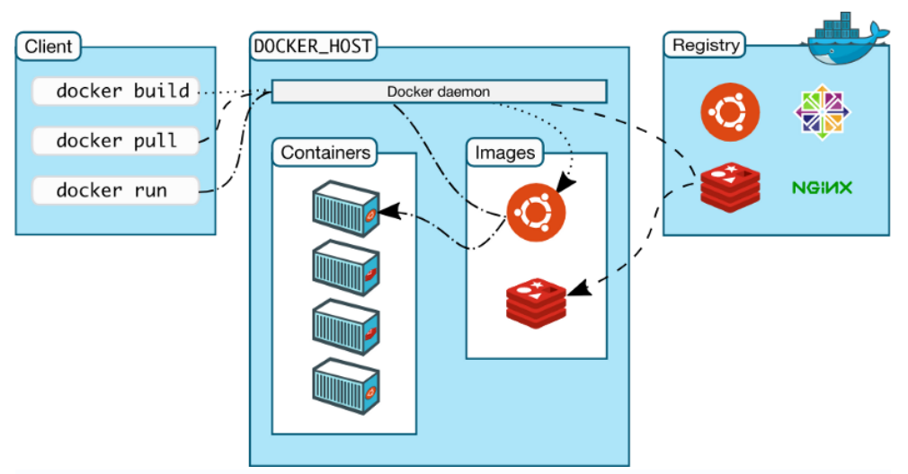

# Docker Concepts
**Docker Platform** — это программа, которая даёт нам возможность упаковывать приложения в контейнеры и запускать их на серверах. Платформа Docker позволяет помещать в контейнеры код и его зависимости. Эти контейнеры могут потом работать на любой операционной системе.

**Docker Engine** — это клиент-серверное приложение.

## Docker Architecture


**Docker Client** — это основное средство, которое используют для взаимодействия с Docker с помощью `Docker CLI`: в терминал вводят команды, обращаясь к клиенту. Клиент Docker взаимодействует с демоном Docker (dockerd), который выполняет работу по созданию, запуску и распространению контейнеров Docker. Клиент и демон Docker взаимодействуют с помощью `REST API`, через сокеты `UNIX` или сетевой интерфейс. Еще один клиент Docker — `Docker Compose`, который позволяет работать с приложениями, состоящими из набора контейнеров.

**Docker Daemon** — прослушивает запросы `Docker API` и управляет объектами Docker, такими как `Images`, `Containers`, `Networks` и `Volumes`. Демон также может взаимодействовать с другими демонами для управления службами Docker.

**Docker Registries** — хранит образы Docker. Docker Hub — это публичный реестр, который может использовать каждый, и Docker по умолчанию ищет изображения в Docker Hub. Можно запустить свой собственный приватный реестр, например `ECR`.

## Virtualization  vs Containerization 
Контейнеризация (*виртуализация на уровне операционной системы, контейнерная виртуализация, зонная виртуализация*) — метод виртуализации, при котором ядро операционной системы поддерживает несколько изолированных экземпляров пространства пользователя вместо одного. 

Эти экземпляры (*обычно называемые контейнерами или зонами*) с точки зрения выполняемых в них процессов идентичны отдельному экземпляру операционной системы. Для систем на базе `Unix` эта технология похожа на улучшенную реализацию механизма `chroot`. Ядро обеспечивает полную изолированность контейнеров, поэтому программы из разных контейнеров не могут воздействовать друг на друга. 

**Гипервизор**, он же монитор виртуальных машин, — это программное обеспечение для создания и запуска виртуальных машин.

В отличие от аппаратной виртуализации, при которой эмулируется аппаратное окружение и может быть запущен широкий спектр гостевых операционных систем, в контейнере может быть запущен экземпляр операционной системы только с тем же ядром, что и у хостовой операционной системы (все контейнеры узла используют общее ядро). При этом при контейнеризации отсутствуют дополнительные ресурсные накладные расходы на эмуляцию виртуального оборудования и запуск полноценного экземпляра операционной системы, характерные при аппаратной виртуализации. Существуют реализации, ориентированные на создание практически полноценных экземпляров операционных систем (Solaris Containers, контейнеры Virtuozzo, OpenVZ), так и варианты, фокусирующиеся на изоляции отдельных сервисов с минимальным операционным окружением (jail, Docker).

Есть три типа виртуализации:
- Паравиртуализация
- Эмуляция
- Контейнерная виртуализация

**Витруализация** – процесс, полностью эмулирующий "компьютер", с процессором, памятью, набором железа, от видеокарты, до жестких дисков. В виртуализации мы полностью помещены в закрытый ящик, из которого теоретически ничего не торчит. В случае полной виртуализации, устройства виртуальной машины полностью эмулируют работу оборудования, вплоть до регистров, памяти и т.д. В этом случае внетренняя программа практически не подозравает о какй-то подмене. 

**Паравиртуализация**, тоже самое, что и в предыдущем случае, но некоторые компоненты, например сетевые или дисковые (и другие) устройства могут быть доступны напрямую через вызовы наружу виртуальной машины (с некоторыми оговорками). Для работы с паравиртуализированным оборудованием нужны отдельные драйверы и программные вызовы. Паравиртуализация основана на программной эмуляции. Паравиртуализация в общем случае работает быстрее, так как нет накладных расходов на ненужную эмуляцию. Происходит модификация ОС с целью выпиливания всего, что может не поддерживается оборудованием со всеми вытекающими последствиями.

## Docker Objects

### Images
Образ — это *read-only* шаблон с инструкциями по созданию Docker-контейнера. Часто изображение основано на другом изображении с некоторой дополнительной настройкой. 

Чтобы создать собственный образ, вы создаете `Dockerfile` с простым синтаксисом для определения шагов, необходимых для создания образа и его запуска. Каждая инструкция в `Dockerfile` создает слой в образе. Когда вы меняете `Dockerfile` и перестраиваете образ, перестраиваются только те слои, которые изменились. Это часть того, что делает образы такими легкими, маленькими и быстрыми по сравнению с другими технологиями виртуализации.

Каждый Docker-образ состоит из слоёв (`layers`), каждый из которых описывает какую-то инструкцию. Далее – Docker объединяет информацию из каждого слоя, и создает шаблон-образ, из которого запускается контейнер, в котором выполняются инструкции из каждого слоя, который был включен в данный образ. Каждый слой описывает какое-то изменение, которое должно быть выполнено с данными на запущенном контейнере. 

Каждая команда в `Dockerfile` – это слой.

### Containers
Контейнер — это работоспособный экземпляр образа. Вы можете создавать, запускать, останавливать, перемещать или удалять контейнер с помощью Docker API или CLI. Вы можете подключить контейнер к одной или нескольким сетям, подключить к нему хранилище или даже создать новый образ на основе его текущего состояния.

Все возможные состояния контейнера Docker:
- **Created**: контейнер создан, но не активен.
- **Restarting**: контейнер в процессе перезапуска.
- **Running**: контейнер работает.
- **Paused**: контейнер приостановлен.
- **Exited**: контейнер закончил свою работу.
- **Dead**: контейнер, который сервис попытался остановить, но не смог
:::note Жизненный цикл контейнера:
Создание контейнера -> Работа контейнера -> 
Приостановка контейнера -> Возобновление работы контейнера ->
Запуск контейнера -> Остановка контейнера -> Перезапуск контейнера ->
Принудительная остановка контейнера -> Удаление контейнера.
:::
:::info
В **conteinerd** отсутствуют управленческие операции с контейнером: нельзя остановить, запустить, работать с регистри.
:::

### Networks
**Docker Networks** нацелено на управление связью между `Docker Container's` и внешним миром. Когда вы запускаете контейнер, вы можете подключить его к одной или нескольким сетям.
- **Изоляция**: по умолчанию Docker обеспечивает сетевую изоляцию между различными контейнерами и группами контейнеров.
- **Связь**: контейнеры в одной сети могут взаимодействовать друг с другом, используя имена контейнеров вместо IP-адресов, что упрощает обнаружение служб.
- **Кастомные сети**: пользователи могут определять свои собственные сети (с помощью пользовательских сетевых драйверов) для лучшего управления сетевой средой, включая определение подсетей, адресов шлюзов и т. д.
```bash
docker network create [OPTIONS] NETWORK       # Create a new network
docker network ls                            # List all networks
docker network rm NETWORK                    # Remove one or more networks
docker network connect NETWORK CONTAINER     # Connect a container to a network
docker network disconnect NETWORK CONTAINER  # Disconnect a container from a network
```

### Container's Filesystem
Когда создается контейнер Docker, он использует файловую систему Union File System (**UFS**), которая состоит из следующих слоев:
- **Read-only Base Image Layer(s)**: это слои `Docker Image`, из которых создается `Docker Container`. Каждый слой соответствует набору изменений или дополнений файлов, сделанных в процессе сборки образа.
- **Writable Container Layer**: это тонкий записываемый слой, добавляемый поверх слоев только для чтения при запуске `Docker Container`. Все изменения, внесенные в файловую систему во время выполнения контейнера, такие как добавление, изменение или удаление файлов, записываются в этот слой.
:::info
Если вы явно не создаете и не используете `Docker Volume's` или не привязываете монтирования, Docker сохраняет данные контейнера в **Writable Container Layer**. Это эфемерное место хранения, которое существует как часть самого контейнера.
:::

### Volumes
Тома используются для сохранения данных, созданных и используемых контейнерами Docker. Они особенно важны для постоянных или общих данных и могут управляться Docker более безопасно и эффективно по сравнению с привязкой монтирования.

Примеры использования томов Docker:
- **Databases**: для таких приложений, как MySQL, PostgreSQL или MongoDB, использование томов гарантирует, что данные базы данных будут сохраняться после окончания срока службы контейнера, что необходимо для предотвращения потери данных во время обновлений и повторных развертываний.
- **Web Applications**: сохраняйте логи, пользовательские загрузки и данные сеансов на томах, чтобы гарантировать сохранение этой информации в случае перезапуска контейнера веб-сервера.
- **Development Environments**: используйте тома для хранения исходного кода или создания артефактов, к которым должны обращаться несколько контейнеров или которые должны пережить перезапуски контейнера во время циклов разработки.
```bash
docker volume create [OPTIONS] [VOLUME]   # Create a volume
docker volume ls                         # List volumes
docker volume rm VOLUME                  # Remove one or more volumes
docker volume inspect VOLUME             # Display detailed information on one or more volumes
```

Пример: Контейнер с хранилищем по умолчанию. Если вы создаете и запускаете контейнер без указания томов или привязки монтирований:
```bash
docker run -d --name my-container nginx
```
- Любые данные, записанные процессом `nginx`, будут сохранены в **Writable Container Layer**.
- Если вы удалите контейнер с помощью `docker rm my-container`, все данные внутри **Writable Container Layer** будут потеряны навсегда.

Использование `Docker Volume's` для предотвращения потери данных:
```bash
docker run -d --name my-container -v my-volume:/data nginx
```
- Здесь Docker будет хранить данные в именованном томе `my-volume`, который сохранится даже при удалении контейнера, что предотвращает потерю данных.

### Docker Volumes vs. Bind Mounts
**Docker Volumes**:
- Управляются Docker. Docker полностью контролирует тома, включая их создание, удаление и миграцию.
- Лучше подходят для использования в производстве, поскольку они более надежны, поддерживают больше параметров конфигурации и отделены от базовой файловой системы хоста.
- Более безопасны, так как демон Docker может накладывать дополнительные ограничения на то, как осуществляется доступ к томам или какие параметры доступны.

**Bind Mounts**:
- Прямое сопоставление файла или дирректории хоста с контейнером. Контейнер напрямую использует файловую систему хоста.
- Проще настроить для простых приложений или для быстрого тестирования, так как вы просто указываете путь на хосте.
- Менее безопасны, так как контейнер имеет прямой доступ к файловой системе хоста, и любые изменения немедленно отражаются на хосте и наоборот.
- Непереносимы, так как существование и местоположение данных тесно связаны с файловой системой хоста.

**Docker Volumes** если вам нужно надежное, безопасное и переносимое управление данными в ваших средах Docker.

**Bind Mounts** может использоваться для более простых, менее критических задач, где необходим прямой доступ к файловой системе хоста.

### Plugins
Плагины расширяют функциональность Docker. Они предоставляют дополнительные возможности, такие как кастомные сетевые драйверы, драйверы хранилищ/томов или даже новые протоколы аутентификации. Это позволяет Docker быть более гибким и интегрироваться с более широким спектром инфраструктур.

*Пример использования*: использование плагина тома для подключения к клауд провайдеру или использование сетевого плагина для интеграции с кастомной или собственной сетевой средой.
```bash
docker plugin install [OPTIONS] PLUGIN[:TAG]  # Install a plugin
docker plugin ls                             # List installed plugins
docker plugin enable PLUGIN                  # Enable a plugin
docker plugin disable PLUGIN                 # Disable a plugin
docker plugin rm PLUGIN                      # Remove a plugin
```

## Docker inspect 
Команда `docker inspect` — это мощный инструмент в Docker, который предоставляет подробную информацию об объектах Docker, таких как контейнеры, образы, тома, сети и т. д. Эта команда извлекает низкоуровневую информацию в формате JSON, что делает ее бесценной для отладки и сценариев автоматизации, которым необходимо понимать конфигурацию и состояние объектов Docker.
```bash
docker inspect my-container
docker inspect ubuntu:latest
docker inspect --format '{{ .NetworkSettings.IPAddress }}' my-container
docker inspect container1 container2 my-volume
```

## Docker Inside Docker (DinD)
Эта настройка включает запуск `Docker Daemon` внутри `Docker Container`. Такая необходимость обычно возникает, когда вы хотите создавать и управлять `Docker Image's` и `Docker Container's` непосредственно из `Jenkins Build Job`, которое само может выполняться внутри `Docker Container`. 

В тех контейнерах можно будет накатывать свои библиотеки и вы хотите создавать образы Docker как часть процесса непрерывной интеграции, вам понадобится способ запустить Docker внутри контейнера CI, к примеру.

Вам понадобится агент **Jenkins**, который может запустить **Docker-in-Docker**. Это подразумевает создание кастомного `Docker Image`, который включает как `Jenkins Agent`, так и сам `Docker Daemon`.
```dockerfile
# Use an official Jenkins agent base image with Docker pre-installed
FROM jenkins/inbound-agent:latest

# Install Docker CLI
USER root
RUN apt-get update && \
    apt-get install -y apt-transport-https ca-certificates curl gnupg-agent software-properties-common && \
    curl -fsSL https://download.docker.com/linux/debian/gpg | apt-key add - && \
    add-apt-repository "deb [arch=amd64] https://download.docker.com/linux/debian $(lsb_release -cs) stable" && \
    apt-get update && \
    apt-get install -y docker-ce docker-ce-cli containerd.io

# Give Jenkins user permissions to run Docker
RUN usermod -aG docker jenkins

# Switch back to the Jenkins user
USER jenkins
```
```jenkinsfile
pipeline {
    agent none // No global agent, define per stage

    stages {
        stage('Build Docker Image') {
            agent {
                docker {
                    image 'my-jenkins-agent-with-docker:latest'
                    args '-v /var/run/docker.sock:/var/run/docker.sock'
                }
            }
            steps {
                script {
                    // Commands to build Docker images
                    sh 'docker build -t my-image:latest .'
                }
            }
        }
    }
}
```
- Директива агента указывает на использование кастомного `Docker Image`, созданного ранее.
- Контейнер агента Jenkins будет совместно использовать сокет Docker с хостом (/var/run/docker.sock). Этот подход, известный как «Docker-outside-of-Docker» (DooD), позволяет избежать некоторых подводных камней настоящего Docker-in-Docker, при этом по-прежнему позволяя выполнять команды Docker в конвейере Jenkins.

## Docker Outside of Docker (DooD)
«Docker-outside-of-Docker» (DooD) — это концепция, в которой вы запускаете команды Docker внутри `Docker Container`, но вместо запуска полного `Docker Daemon` внутри контейнера (как в Docker-in-Docker или DinD) вы получаете доступ к `Docker Daemon` хост-машины изнутри `Docker Container`. Обычно это достигается путем монтирования сокета Docker из хоста в контейнер. Такой подход позволяет контейнерам использовать демон Docker хоста для создания, управления и запуска других контейнеров Docker напрямую.

Вот базовая настройка для `Docker-outside-of-Docker`:

- **Docker Socket**: `Docker Daemon` на хосте прослушивает сокет Unix (/var/run/docker.sock) на предмет запросов API. По умолчанию только локальные процессы с `root` или членством в группе docker могут взаимодействовать с этим сокетом.
- **Монтирование сокета**: Когда вы запускаете контейнер и хотите, чтобы он мог взаимодействовать с `Docker Daemon` хоста, вы монтируете этот сокет Docker внутри `Docker Container`. Это позволяет процессам внутри `Docker Container` взаимодействовать с `Docker Daemon`, как если бы они работали на хосте.
- **Разрешения для контейнера**: Контейнер не обязательно должен быть запущен в привилегированном режиме, но пользователю внутри контейнера нужны соответствующие разрешения для взаимодействия с сокетом Docker. Часто это управляется путем добавления пользователя внутри контейнера в группу docker.
```bash
docker run -it -v /var/run/docker.sock:/var/run/docker.sock docker:latest sh
```