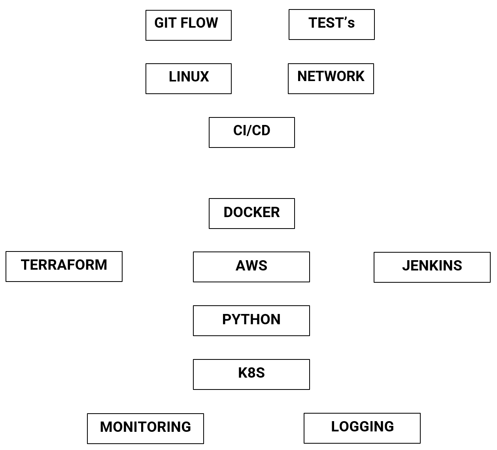
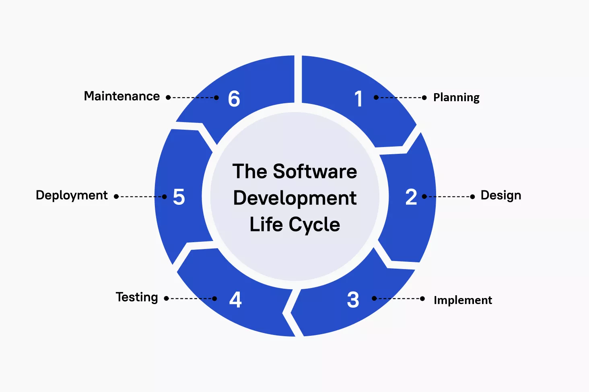

# Home Page

## SRE/DevOps/Platform Engineering RoadMap

## SRE vs DevOps
### SRE
SRE помогает бизнесу максимизировать надежность системы, повысить масштабируемость и эффективно управлять инцидентами и временем реагирования. SRE не фокусируется на том, что строить. Основное внимание уделяется тому, как создавать и развертывать продукты, сохраняя при этом доступность системы и производительность пользователей.

### DevOps
DevOps предлагает совместный инклюзивный подход к комплексной разработке и эксплуатации программного обеспечения. Это устраняет разрозненность, позволяя командам более эффективно взаимодействовать и добиваться наилучших результатов на протяжении всего жизненного цикла разработки продукта. Инструменты DevOps заменяют медленные и ручные процессы автоматизацией и непрерывной доставкой, которая включает постоянную обратную связь.

## SLA
**SLA** (*service-level agreement*) - это аутсорсинговый договор с провайдером технологий, сервиса, услуги, где описывается уровень обслуживания, который провайдер обещает предоставить клиенту. В нем указываются такие метрики, как время безотказной работы (`uptime`), `delivery time`, `response time` и `resolution time`. Если идет несоблюдение **SLA**, то возможны каки-то специальные предложения или скидки.
### SLO
**SLO** (*service-level objective*) - это соглашение в рамках **SLA** о конкретных показателях, таких как response time или uptime . Если **SLA** — это официальное соглашение между вами и вашим клиентом, **SLO** — это отдельные обещания, которые вы даете этому клиенту. **SLO** — это то, что формирует ожидания клиентов и сообщает ИТ-командам и DevOps, какие цели им нужно достичь и с какими целями себя сравнивать.
### SLI
**SLI** (*service-level indicator*) - измеряет соответствие **SLO**. Так, например, если в вашем **SLA** указано, что ваши системы будут доступны 99,95% времени, ваш **SLO**, скорее всего, будет обеспечивать бесперебойную работу в течение 99,95% времени, а ваш **SLI** — это фактическое измерение вашего времени безотказной работы. Возможно, это 99,96%. Может быть, 99,99%. Чтобы оставаться в соответствии с вашим соглашением об уровне обслуживания, **SLI** должен будет выполнять или превосходить обещания, данные в этом документе.

## IaaS | PaaS | SaaS

### IaaS
Инфраструктура как услуга (**IaaS**) — это тип сервиса облачных вычислений, который предлагает необходимые вычислительные, хранилища и сетевые ресурсы по требованию и с оплатой по факту использования. **IaaS** — это один из четырех типов облачных сервисов, наряду с программным обеспечением как услугой (**SaaS**), платформой как услугой (**PaaS**) и бессерверным сервисом.

### PaaS
Платформа как услуга относится к сервисам облачных вычислений, которые предоставляют среду по требованию для разработки, тестирования, доставки и управления программными приложениями. **PaaS** разработан, чтобы разработчикам было проще быстро создавать веб-или мобильные приложения, не беспокоясь о настройке или управлении базовой инфраструктурой серверов, хранилища, сети и баз данных, необходимых для разработки.

### SaaS
Программное обеспечение как услуга — это метод доставки программных приложений через Интернет по требованию и обычно на основе подписки. Используя **SaaS**, поставщики облачных услуг размещают и управляют программным приложением и базовой инфраструктурой. Эти поставщики также выполняют любое обслуживание, например обновления программного обеспечения и исправления безопасности. Пользователи подключаются к приложению через Интернет, обычно с помощью веб-браузера на своем телефоне, планшете или ПК.

## SDLC
**SDLC** описывает задачи, необходимые для создания программного приложения. Процесс разработки проходит через несколько этапов, когда разработчики добавляют новые функции и исправляют ошибки в программном обеспечении.

## Планирование (Plan)
Этап планирования обычно предусматривает выполнение таких заданий, как анализ затрат и выгод, составление расписания, оценка и распределение ресурсов. Команда разработчиков собирает требования от нескольких заинтересованных сторон, таких как клиенты, внутренние и внешние эксперты и менеджеры, чтобы создать документ спецификации требований к программному обеспечению.

Документ устанавливает ожидания и определяет общие цели, которые помогают в планировании проекта. Команда оценивает затраты, составляет график и разрабатывает подробный план достижения поставленных целей.

## Проектирование (Design)
На этапе проектирования инженеры-программисты анализируют требования и определяют наилучшие решения для создания программного обеспечения. Например, они могут рассмотреть возможность интеграции уже существующих модулей, сделать выбор технологии и определить средства разработки. Они рассмотрят, как наилучшим образом интегрировать новое программное обеспечение в существующую ИТ-инфраструктуру организации.

## Внедрение (Implement)
На этапе внедрения команда разработчиков пишет код. Они анализируют требования, чтобы определить более мелкие задачи по кодированию, которые можно выполнять ежедневно для достижения конечного результата.

## Тестирование (Test)
Команда разработчиков сочетает автоматизацию и ручное тестирование для проверки программного обеспечения на наличие ошибок. Анализ качества подразумевает тестирование программного обеспечения на наличие ошибок и проверку его соответствия требованиям заказчика. Поскольку многие команды сразу же тестируют написанный ими код, этап тестирования часто проходит параллельно с этапом разработки.

## Развертывание (Deploy)
Когда команды разрабатывают программное обеспечение, они выполняют кодирование и тестирование на копии программного обеспечения, отличной от той, к которой имеют доступ пользователи. Программное обеспечение, которое используют клиенты, называется производственным, в то время как другие копии, как правило, находятся в среде сборки, или среде тестирования.

Наличие отдельных сред сборки и производства гарантирует, что клиенты смогут и далее использовать программное обеспечение даже в процессе его изменения или обновления. Этап развертывания предусматривает выполнение нескольких заданий по перемещению последней копии сборки в производственную среду, таких как упаковка, конфигурация среды и установка.

## Обслуживание (Maintain)
На этапе обслуживания, помимо прочих задач, команда исправляет ошибки, решает проблемы клиентов и управляет изменениями в программном обеспечении. Кроме того, команда следит за общей производительностью системы, безопасностью и удобством работы пользователей, чтобы определить новые способы улучшения существующего программного обеспечения.

