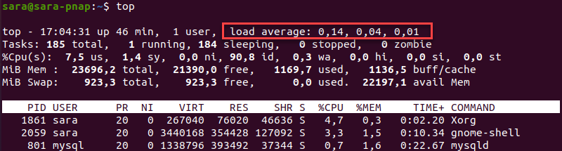

# Troubleshooting

## OOMKilled
> Container in pod has been OOMKilled 1 times in the last 120 minutes. По памяти планка идет 286 Мб, т.е. до лимита 364М, вроде запасик был.
Скорее всего киллер его прибил, потому что на ноде было недостаточно ресурсов. У вас реквесты низковатые. Только реквест гарантируется. Лимит не гарантируется. Поду просто дают жрать выше реквеста, но ниже лимита только в случае, если на ноде есть свободные ресурсы.

## NodeSystemSaturation
> System load per core at node has been above 2 for the last 15 minutes, is currently at 4.78.
This might indicate this instance resources saturation and can cause it becoming unresponsive.
System saturated, load per core is very high.
https://runbooks.prometheus-operator.dev/runbooks/node/nodesystemsaturation

Load Average - средняя нагрузка:
https://phoenixnap.com/kb/linux-average-load

Это метрика, которая показывает количество задач, выполняемых в данный момент CPU, и задач, ожидающих в очереди.

В отличие от CPU Usage, которое измеряет производительность системы в определенный момент времени, Load Average показывает производительность за определенный период. Количество процессов, запущенных в системе, постоянно меняется, и Load Average отображает это изменение.

Вывод показывает, что система работает 46 минут с момента последней загрузки, а количество активных пользователей равно 1.
Средняя нагрузка на одного пользователя составляет:
- 0,14 за последнюю 1 минуту.
- 0,04 за последние 5 минут.
- 0,01 за последние 15 минут.
Результаты рассчитываются путем деления количества запущенных и ожидающих процессов на количество доступных ядер ЦП.

## Terminated With Exit Code 1
https://komodor.com/learn/how-to-fix-container-terminated-with-exit-code-1/