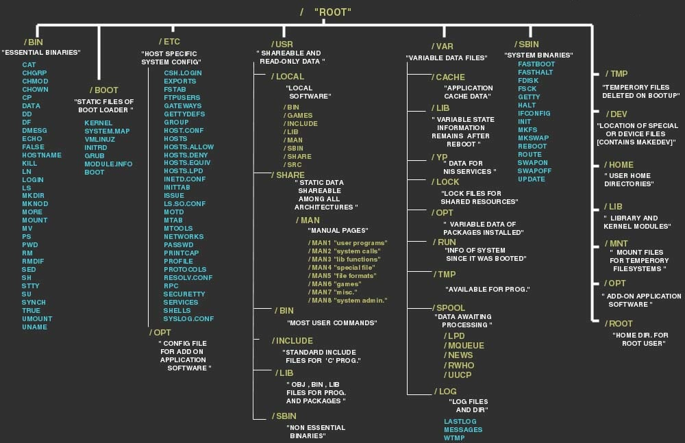

# File System

## Filesystem Hierarchy


## File types

По умолчанию в Unix есть только три типа файлов:
- Regular files (`-`)
- Directory files (`d`)
- Special files (Actually, this one has 5 types in it.)
  - Block file(`b`)
  - Character device file(`c`)
  - Named pipe file or just a pipe file(`p`)
  - Symbolic link file(`l`)
  - Socket file(`s`) 

Here are those three types (`-`, `d`, and `l`):
```bash
$ ls -l
total 4
drwxrwxr-x 2 k k 4096 Dec  9 09:16 mydir
-rw-rw-r-- 1 k k    0 Dec  9 09:16 myfile1
-rw-rw-r-- 1 k k    0 Dec  9 09:16 myfile2
lrwxrwxrwx 1 k k    7 Dec  9 09:16 my_link -> myfile1
```
### Block file type
Эти файлы являются аппаратными, и большинство из них находятся в каталоге `/dev`. Они создаются либо командой `fdisk`, либо путем создания разделов.
```bash
$ ls -l /dev/  | grep ^b
brw-rw----  1 root disk        7,   0 Dec  8 13:31 loop0
brw-rw----  1 root disk        7,   7 Dec  8 13:31 loop7

brw-rw----  1 root disk        1,   0 Dec  8 13:31 ram0
brw-rw----  1 root disk        1,  15 Dec  8 13:31 ram15

brw-rw----  1 root disk        8,   0 Dec  8 13:31 sda
brw-rw----  1 root disk        8,   1 Dec  8 13:31 sda1
brw-rw----  1 root disk        8,   2 Dec  8 13:31 sda2
brw-rw----  1 root disk        8,   3 Dec  8 13:31 sda3

brw-rw----+ 1 root cdrom      11,   0 Dec  8 13:31 sr0
```
### Character device file type
Файл символьного устройства обеспечивает последовательный поток ввода или вывода. Наши терминалы являются классическим примером файлов такого типа.
```bash
$ ls -l /dev/input/mouse0 |grep ^c
crw-r----- 1 root root 13, 32 Dec  9 08:39 /dev/input/mouse0
```
и:
```bash
$ ls -l /dev | grep ^c
crw-------  1 root root        5,   1 Dec  8 13:32 console
crw-------  1 root root       10,  58 Dec  8 13:31 network_throughput
crw-rw-rw-  1 root root        1,   3 Dec  8 13:31 null
crw-r-----  1 root kmem        1,   4 Dec  8 13:31 port
crw-------  1 root root       10, 231 Dec  8 13:31 snapshot
crw-rw-rw-  1 root tty         5,   0 Dec  8 22:41 tty
```

### Pipe file type
```bash
$ mkfifo backpipe
$ ls -l
prw-rw-r--   1 k k    0 Dec  9 09:56 backpipe
drwxrwxr-x   2 k k 4096 Dec  9 09:16 mydir
-rw-rw-r--   1 k k    0 Dec  9 09:16 myfile1
-rw-rw-r--   1 k k    0 Dec  9 09:16 myfile2
lrwxrwxrwx   1 k k    7 Dec  9 09:16 my_link -> myfile1
```

### symbolic link file type
Это связанные файлы с другими файлами. Это либо каталог, либо обычный файл. Номер индексного дескриптора для этого файла и его родительских файлов одинаковый. В Linux/Unix доступны два типа файловых ссылок: `мягкая` и `жесткая` ссылка (`soft` and `hard` link).
```bash
$ ls -l
total 4
drwxrwxr-x 2 k k 4096 Dec  9 09:16 mydir
-rw-rw-r-- 1 k k    0 Dec  9 09:16 myfile1
-rw-rw-r-- 1 k k    0 Dec  9 09:16 myfile2
lrwxrwxrwx 1 k k    7 Dec  9 09:16 my_link -> myfile1
```

### socket file type
Файл сокета используется для передачи информации между приложениями.
```bash
$ ls -l /var/run/ | grep ^s
srw-rw-rw- 1 root       root          0 Dec  8 13:31 acpid.socket
srw-rw---- 1 root       docker        0 Dec  8 14:15 docker.sock
srw-rw-rw- 1 root       root          0 Dec  8 13:31 rpcbind.sock
srw-rw-rw- 1 root       root          0 Dec  8 13:31 sdp
srwxr-xr-x 1 root       root          0 Dec  8 13:32 vmnat.5546
```

## File permissions
Права доступа к файлам в Linux в числовом режиме трехзначное значение представляет определенные права доступа к файлу (например, **744**). Они называются восьмеричными значениями. Первая цифра соответствует разрешениям владельца, вторая цифра — разрешениям группы, а третья — другим пользователям. Каждому разрешению присвоено числовое значение:
  - r (read): 4
  - w (write): 2
  - x (execute): 1
Суммируя значения каждой классификации пользователей, вы можете определить права доступа к файлам.
Например, файл может иметь разрешения на чтение, запись и выполнение для своего владельца и только разрешение на чтение для всех остальных пользователей. Это выглядит так:
  - Owner: rwx = 4+2+1 = **7**
  - Group: r-- = 4+0+0 = **4**
  - Others: r-- = 4+0+0 = **4**

Результаты дают трехзначное значение: **744**.
### chmod
Вы можете изменить права доступа к файлам и директориям с помощью команды `chmod`, что означает «изменить режим». Например:
```bash
chmod ug+rwx example.txt
```
```bash
chmod o+r example2.txt
```
```bash
chmod +x /usr/lib/zabbix/externalscripts/*
```
Это разрешает чтение, запись и выполнение для пользователя и группы и только чтение для других. В символьном режиме `chmod u` представляет права владельца пользователя, `chmod g` представляет других пользователей в группе файла, `chmod o` представляет других пользователей, не входящих в группу файла. Для всех пользователей используйте `chmod a`.

### chown

### SUID, SGID и Sticky-біт