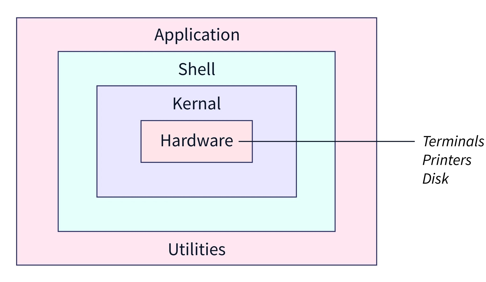

# Linux architecture

## General

**Linux** – это форк (использование кодовой базы программного проекта в качестве старта для другого) системы **UNIX**. 

**Linux** — это ядро, а это означает, что оно управляет ресурсами системы, такими как процессор, память и операции ввода-вывода. 

В то время как **Linux** является открытым исходным кодом и бесплатен в использовании, **UNIX** является проприетарной операционной системой, лицензия которой платная. Пример **UNIX** системы – **MacOS**.

:::info

Основными компонентами **OS Linux** являются: **Kernel** (`ядро`), **System Library** (`приложения`), **Shell** (`оболочка`), **Hardware Layer** (`апаратные компоненты`), **System utility** (`apt`, `cd`, `tar`, `htop` и тд.).

**Архитектура ядра** разделена на две основные части:
- **User Space**;
- **Kernel Space**.

Основные **подсистемы ядра**:
- **Process scheduler**;
- **Memory management unit**;
- **Linux File System**: root(`/`) and sub-directory (`others`).

:::

## Kernel (ядро)
**Ядро** — это небольшой специальный код, который является основным компонентом ОС Linux и напрямую взаимодействует с `Hardware`. Это промежуточный уровень между программным и аппаратным обеспечением, который обеспечивает низкоуровневое обслуживание компонентов пользовательского режима. Он полностью разработан на языке C и с архитектурой файловой системы. Кроме того, он имеет различные блоки, которые управляют различными операциями. 
Представляет собой монолитное ядро, что означает, что оно содержит все основные функции операционной системы в одном исполняемом файле. Он имеет высокую модульность и настраиваемость, поддерживает широкий спектр аппаратных устройств и конфигураций системы.

**Ядро** одновременно запускает несколько процессов и управляет различными ресурсами. Рассматривается как менеджер ресурсов, когда в системе одновременно запускаются несколько программ. В этом случае ядро представляет собой экземпляр, который совместно использует доступные ресурсы, такие как `CPU time`, `Disk space`, `Network connections` и т. д. 

### Архитектура ядра разделена на две основные части:
- **User Space**:
>Все пользовательские программы и приложения выполняются в пользовательском пространстве. Пользовательское пространство не может напрямую получить доступ к памяти и оборудованию. Он получает доступ к оборудованию через пространство ядра. Процессы или программы, работающие в пользовательском пространстве, получают доступ к некоторой части памяти только посредством системного вызова. Благодаря полной защите сбои в пользовательском режиме можно восстановить.
Библиотека GNU C предоставляет механизм переключения приложения пользовательского пространства в пространство ядра.
- **Kernel Space**.
>Все программы ядра выполняются в пространстве ядра. Пространство ядра имеет доступ к полной части памяти и напрямую взаимодействует с оборудованием, таким как ОЗУ, жесткий диск и т. д. Оно разделено на различные блоки и модули, которые управляют всеми операциями (такими как управление файлами, управление памятью, управление процессами и т. д.) в пространстве ядра и приложениями, работающими в нем. пространство пользователя. Пространство ядра состоит из интерфейса системных вызовов, ядра (основного компонента Linux) и модуля устройства.

### System Calls Interface
Это промежуточный уровень между пользовательским пространством и пространством ядра. Каждое приложение, запущенное в пользовательском пространстве, может взаимодействовать с ядром через интерфейс системных вызовов. Например, функции системного вызова при операции с файлом:  `open ( )`, `write ( )`, `read ( )` и т. д.

Основные **подсистемы ядра**:
- **Process scheduler**: управление различными процессами, которые выполняются одновременно. Процесс — это экземпляр «исполняемой программы», такой как открытие файла, доступ к диску, доступ к внешнему ресурсу (например, принтеру) и т. д., и его можно создавать и уничтожать. Управление процессами предоставляет информацию о том, что происходит с процессом, и управляет его приоритетами, например, какой адрес следует назначить процессу, файл, выделенный для процесса, состояние процесса (например, запуск, ожидание, остановка);
- **Memory management unit**: наиболее важная часть ядра, которая отвечает за назначение адресного пространства процессам и приложениям. По сути, управление памятью назначает виртуальную память вместо физической памяти, причем последняя представляет собой фактическое адресное пространство в ОЗУ. Не путайте физическую и виртуальную память. Назначение виртуального адреса преодолевает ограничение назначения физической памяти. Преобразование физического адреса в виртуальный адрес выполняется с помощью **MMU** (Memory Management Unit) - модуля управления памятью, который обеспечивает защиту от помех памяти, совместное использование памяти и выделение виртуальной памяти.
- **Linux File System**: Файловая система Linux представляет собой иерархически структурированное дерево данных, которое организует файловую систему. Файл — это простая структура данных (в виде некоторого байта памяти), которая может хранить на компьютере любые данные, такие как текст, изображения, видео, музыку и все, что вы захотите. Файловая система Linux организована в виде каталога в виде дерева. Каталог — это набор или группа файлов. В системе Linux доступны два типа директорий: 
  - **корневая (root) директория**: является основным каталогом, и доступ к нему невозможен без разрешения суперпользователя. Это родительский и основной каталог в файловой системе, обозначаемый косой чертой (**/**);
  - **саб-директория**: находится в корневом каталоге, который может быть создан или переименован пользователем. 

## System Library (приложения)
Системные библиотеки — это некоторые предопределенные функции, с помощью которых любые прикладные программы или системные утилиты могут получить доступ к функциям ядра. Эти библиотеки являются основой, на которой может быть построено любое программное обеспечение.
Некоторые из наиболее распространенных системных библиотек:
- **GNU C library**: Это библиотека C, предоставляющая наиболее фундаментальную систему для интерфейса и выполнения программ C. Это обеспечивает множество встроенных функций для выполнения;
- **ibpthread** (POSIX Threads): Эта библиотека играет важную роль в многопоточности в Linux, она позволяет пользователям создавать несколько потоков и управлять ими;
- **libdl** (Dynamic Linker): Эта библиотека отвечает за загрузку и связывание файла во время выполнения;
- **libm** (Math Library): Эта библиотека предоставляет пользователю все виды математических функций и их выполнение.

Некоторые другие системные библиотеки: librt (Realtime Library), libcrypt (Cryptographic Library), libnss (Name Service Switch Library), libstdc++ (C++ Standard Library).

## Shell (оболочка)
Оболочку можно определить как интерфейс ядра, который скрывает от пользователя внутреннее выполнение функций ядра. Пользователи могут просто ввести команду и, используя функцию ядра, выполнить конкретную задачу соответствующим образом.
Различные типы оболочки:
- **Command Line Interface (CLI)**: Выполняет команду, предоставленную пользователем, указанную в форме команды. Выполняется специальная программа под названием терминал, и результат отображается в самом терминале;
- **Graphical User Interface (GUI)**: Выполняет процесс, предоставленный пользователем, в графическом виде, а выходные данные отображаются в графическом окне.

## Hardware Layer (апаратные компоненты)
Аппаратный уровень Linux — это самый низкий уровень операционной системы. Он играет жизненно важную роль в управлении всеми аппаратными компонентами. Он включает в себя драйверы устройств, функции ядра, управление памятью, управление процессором и операции ввода-вывода. Этот уровень обобщает высокую сложность, предоставляя интерфейс для программного обеспечения и гарантируя правильную функциональность всех компонентов.

## System utility
Системные утилиты — это инструменты командной строки, которые выполняют различные задачи, предоставляемые пользователем, чтобы улучшить управление и администрирование системы. Эти утилиты позволяют пользователю выполнять различные задачи, такие как управление файлами, мониторинг системы, настройка сети, управление пользователями и т. д.
(`apt`, `cd`, `tar`, `htop` и тд.).