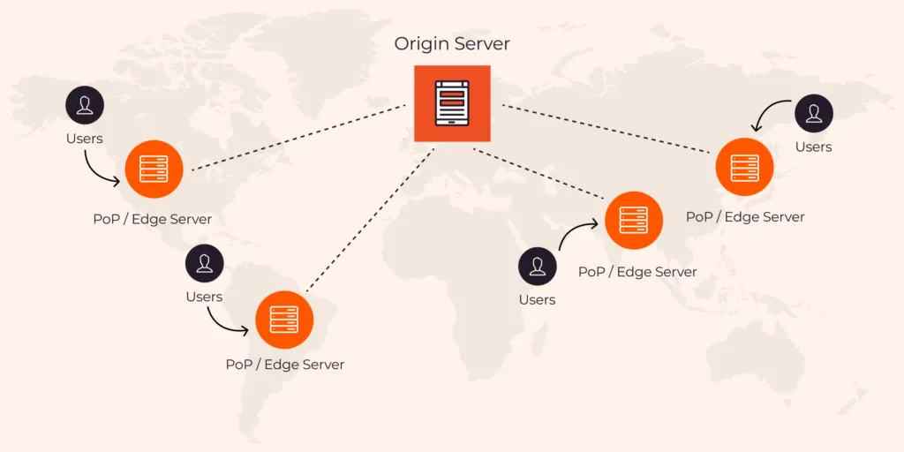

# CDN

## Content Delivery Network
**CDN** — это географически распределенная группа серверов, которые кэшируют контент рядом с конечными пользователями. **CDN** позволяет быстро передавать `assets` - HTML-страницы, файлы JavaScript, таблицы стилей, изображения, текстовый контент, графика, видео, аудиофайлы и базы данных.

**CDN** не занимается хостингом контента, он помогает `кэшировать` контент на границе сети, что повышает производительность веб-сайта.

> Представьте себе сеть серверов, разбросанную по всему миру, на которых хранится контент веб-сайта. Эти серверы называются точками присутствия (*Points of Presence*, `PoPs`) или пограничными серверами (`edge servers`). Дублируя часто запрашиваемый контент, **CDN** могут доставлять контент быстрее и снижать нагрузку на веб-сайты и приложения, обслуживая контент из близлежащих точек доступа.

## CDN caching Process
1. Пользователь запрашивает контент с веб-сайта, введя `URL-адрес` в свой браузер.
2. Запрос отправляется на ближайший сервер точки присутствия (`PoP`) в **CDN**.
3. Сервер `PoP` проверяет, есть ли запрошенный контент в его кэше. Если это так, он немедленно отправляет его обратно в браузер пользователя.
4. Если `PoP-сервер` не имеет контента в своем кеше, он перенаправляет запрос на исходный сервер (`Origin Server`), где хранится контент.
5. `Origin Server` отправляет контент обратно на `PoP-сервер`, который отправляет его в браузер пользователя и кэширует для будущих запросов.
6. Другие `PoP-серверы` в **CDN** также кэшируют контент, поэтому, если другой пользователь, расположенный рядом с другим `PoP`, запрашивает тот же контент, он может быть доставлен с ближайшего к нему `PoP-сервера`, что снижает задержку и повышает производительность.
7. Содержимое кэшируется на определенное время в зависимости от настроек **CDN** и исходного сервера веб-сайта. По истечении срока действия кэша процесс повторяется, и контент можно снова обслуживать с исходного сервера.

## Anycast and Unicast
**Unicast**: каждая нода в сети получает уникальный IP-адрес, один сервер содержит один IP адрес - клиент обращается напрямую к каждому серверу по его IP.

**Anycast**: каждая нода в сети имеет один и тот же IP-адрес, все серверы содержат один IP адрес - клиент обращается к близжайшему серверу.

**CDN** сервисы используют `Anycast` как метод роутинга. Если к одному и тому же `Origin Server` одновременно отправляется множество запросов, `Origin Server` может быть перегружен трафиком и не сможет эффективно отвечать на дополнительные входящие запросы. В сети `Anycast` вместо одного `Origin Server`, принимающего на себя основную нагрузку трафика, нагрузка также может быть распределена по другим доступным центрам обработки данных, каждый из которых будет иметь серверы, способные обрабатывать входящий запрос и отвечать на него. Этот метод маршрутизации может помешать исходному серверу расширить емкость и избежать перебоев в обслуживании клиентов, запрашивающих контент с `Origin Server`.