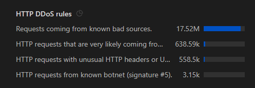

# CloudFlare
## OWASP Rules
https://owasp.org/www-project-modsecurity-core-rule-set/
https://github.com/coreruleset/coreruleset/tree/main

## HTTP DDoS rules
They are managed rulesets provided by **Cloudflare**, and they are generally predefined and non-editable by users. They are part of Cloudflare’s DDoS protection system, leveraging threat intelligence across their entire network. You can usually enable, disable, or adjust sensitivity thresholds in some plans, but you cannot change or customize the exact matching logic or rule content for these particular managed rules (unless you're on Enterprise with advanced options like custom WAF rules).

- IP addresses, ASNs, or networks that Cloudflare knows are associated with malicious behavior.
- Cloudflare continuously updates its threat intelligence feeds based on:
- - Data from attacks seen across millions of sites it protects.
- - External threat intelligence sources.
- - Behavioral patterns of bad actors.

Examples of `known bad sources` include:
- Botnets’ IP ranges.
- Compromised servers (e.g., open proxies, infected machines).
- Known DDoS tools / frameworks' default IP ranges.