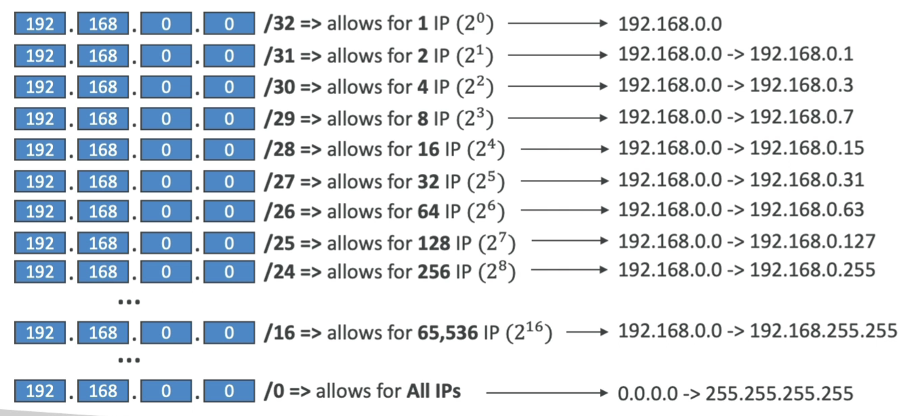

# Concepts

## OSI Model (7 Layers)
Модель *Open Systems Interconnection* (**OSI**) - это концептуальная модель, которая характеризует и стандартизирует коммуникационные функции. Цель — обеспечение совместимости различных систем связи со стандартными протоколами. Модель разделяет систему связи на уровни абстракции.
1. **Physical Layer**: отвечает за физическое кабельное или беспроводное соединение между сетевыми узлами. Он определяет разъем, электрический кабель или беспроводную технологию, соединяющую устройства, и отвечает за передачу необработанных данных, которые представляют собой просто последовательность нулей и единиц, при этом обеспечивая контроль скорости передачи данных.
2. **Data Link**: устанавливает и завершает соединение между двумя физически соединенными узлами в сети. Он разбивает пакеты на кадры и отправляет их от источника к месту назначения. Этот уровень состоит из двух частей — Logical Link Control (LLC), который идентифицирует сетевые протоколы, выполняет проверку на ошибки и синхронизирует кадры, и Media Access Control (MAC), который использует MAC-адреса для подключения устройств и определяет разрешения на передачу и получение данных.
3. **Network**: Имеет две основные функции. Одна из них — разбиение сегментов на сетевые пакеты и повторная сборка пакетов на принимающей стороне. Другая — маршрутизация пакетов путем обнаружения наилучшего пути через физическую сеть. Сетевой уровень использует сетевые адреса (обычно адреса протокола Интернета) для маршрутизации пакетов к узлу назначения.
4. **Transport**: берет данные, переданные на сеансовом уровне, и разбивает их на «сегменты» на передающем конце. Он отвечает за повторную сборку сегментов на принимающем конце, превращая их обратно в данные, которые могут быть использованы сеансовым уровнем. Транспортный уровень осуществляет управление потоком, отправляя данные со скоростью, соответствующей скорости соединения принимающего устройства, и контроль ошибок, проверяя, были ли данные получены неправильно, и если нет, запрашивая их снова.
5. **Session**: создает каналы связи, называемые сеансами, между устройствами. Он отвечает за открытие сеансов, обеспечение их открытости и работоспособности во время передачи данных и закрытие их по завершении связи. Уровень сеанса также может устанавливать контрольные точки во время передачи данных — если сеанс прерывается, устройства могут возобновить передачу данных с последней контрольной точки.
6. **Presentation**: подготавливает данные для прикладного уровня. Он определяет, как два устройства должны кодировать, шифровать и сжимать данные, чтобы они были правильно получены на другом конце. Уровень представления принимает любые данные, переданные прикладным уровнем, и подготавливает их для передачи через сеансовый уровень.
7. **Application**: используется программным обеспечением конечного пользователя, таким как веб-браузеры и почтовые клиенты. Он предоставляет протоколы, которые позволяют программному обеспечению отправлять и получать информацию и представлять значимые данные пользователям. Несколько примеров протоколов прикладного уровня — это протокол передачи гипертекста (HTTP), протокол передачи файлов (FTP), почтовый протокол (POP), простой протокол передачи почты (SMTP) и система доменных имен (DNS).

## TCP/IP Model (4 Layers)

1. **Network**: управляет связью между устройствами в одном сегменте сети. Он охватывает такие протоколы, как Ethernet и Wi-Fi, которые определяют, как форматируются данные для передачи по физическим соединениям. Канальный уровень решает такие проблемы, как обнаружение и исправление ошибок, а также управление доступом к физическому носителю.
2. **Internet**: отвечает за маршрутизацию пакетов по сетям. Он использует IP (Internet Protocol) для назначения адресов устройствам и определения наилучшего пути для передачи данных. IP-адреса позволяют устройствам находить друг друга в Интернете и облегчают доставку пакетов по разным сетям.
3. **Transport**: обеспечивает надежную передачу данных между устройствами. Он использует такие протоколы, как TCP (Transmission Control Protocol) и UDP (User Datagram Protocol). TCP обеспечивает надежную связь с установлением соединения, в то время как UDP предлагает ненадежную связь без установления соединения. TCP гарантирует, что пакеты данных будут доставлены в правильном порядке и без ошибок, в то время как UDP жертвует надежностью ради скорости.
4. **Application**: напрямую взаимодействует с конечными пользователями и приложениями. Здесь находятся такие протоколы, как HTTP (протокол передачи гипертекста), SMTP (простой протокол передачи почты) и FTP (протокол передачи файлов). Уровень приложений обрабатывает высокоуровневые детали связи, такие как форматирование и шифрование данных.

## DCP

## CIDR
**Classless Inter-Domain Routing** (*бесклассовая междоменная маршрутизация*) — это метод выделения **IP**-адресов, который повышает эффективность маршрутизации данных в Интернете. Каждая машина, сервер и устройство конечного пользователя, подключающееся к Интернету, имеют связанный с ним уникальный номер, называемый **IP**-адресом. Устройства находят друг друга и взаимодействуют друг с другом, используя эти **IP**-адреса. Организации используют **CIDR** для гибкого и эффективного распределения **IP**-адресов в своих сетях. Вместо классификации **IP**-адреса на основе классов маршрутизаторы получают адрес сети и хоста, указанный суффиксом **CIDR**.

**CIDR** используется в правилах фаерволов (как и в нетворкинге в целом) и помогает определить ренж **IP** адресов. Например, *ww.xx.yy.zz/32* => `1` **IP**, а *0.0.0.0/0* => все **IPs**. Если мы укажем *192.168.0.0/26* - это будет ренж от *192.168.0.0* до *192.168.0.63* (`64` **IP** адреса).

**CIDR** состоит из двух компонентов:
- **Base IP**: базовый IP, типо 10.0.0.0, 192.168.0.0 и тд.
- **Subnet Mask**: определяет сколько можно именить битов в IP (/0, /24, /34).

**Subnet Mask** в основном позволяет части базового **IP**-адреса получать дополнительные следующие значения из базового **IP**-адреса.

https://aws.amazon.com/what-is/cidr/

### Public vs Private IP
**IANA** (*Internet Assigned Numbers Authority*) установили определенные блоки адресов **IPv4** для использования частных (**LAN**) и общедоступных (**Интернет**) адресов:
- Private IP: 
  - *10.0.0.0* - *10.255.255.255* (**10.0.0.0/8**) 
  - *172.16.0.0* - *172.31.255.255* (**172.16.0.0/12**) AWS default VPC in that range
  - *192.168.0.0* - *192.168.255.255* (**192.168.0.0/16**) home networks

Все остальные ренжи являются публичными.