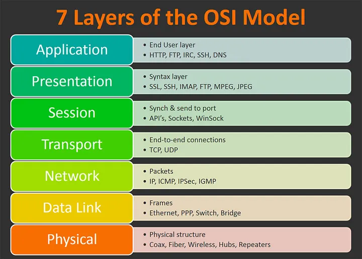
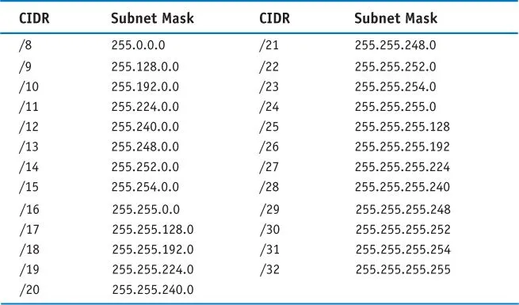
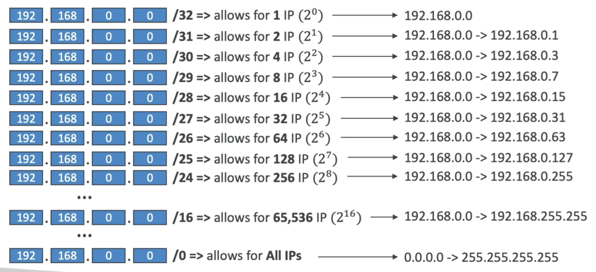
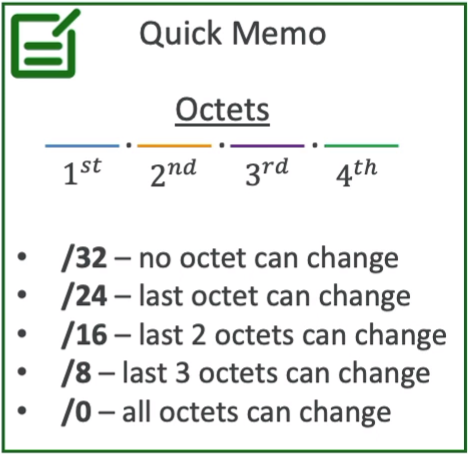

# OSI
Модель *Open Systems Interconnection* (**OSI**) - это концептуальная модель, которая характеризует и стандартизирует коммуникационные функции. Цель — обеспечение совместимости различных систем связи со стандартными протоколами. Модель разделяет систему связи на уровни абстракции.

## DCP

## CIDR
**Classless Inter-Domain Routing** (*бесклассовая междоменная маршрутизация*) — это метод выделения **IP**-адресов, который повышает эффективность маршрутизации данных в Интернете. Каждая машина, сервер и устройство конечного пользователя, подключающееся к Интернету, имеют связанный с ним уникальный номер, называемый **IP**-адресом. Устройства находят друг друга и взаимодействуют друг с другом, используя эти **IP**-адреса. Организации используют **CIDR** для гибкого и эффективного распределения **IP**-адресов в своих сетях. Вместо классификации **IP**-адреса на основе классов маршрутизаторы получают адрес сети и хоста, указанный суффиксом **CIDR**.

**CIDR** используется в правилах фаерволов (как и в нетворкинге в целом) и помогает определить ренж **IP** адресов. Например, *ww.xx.yy.zz/32* => `1` **IP**, а *0.0.0.0/0* => все **IPs**. Если мы укажем *192.168.0.0/26* - это будет ренж от *192.168.0.0* до *192.168.0.63* (`64` **IP** адреса).

**CIDR** состоит из двух компонентов:
- **Base IP**: базовый IP, типо 10.0.0.0, 192.168.0.0 и тд.
- **Subnet Mask**: определяет сколько можно именить битов в IP (/0, /24, /34).

**Subnet Mask** в основном позволяет части базового **IP**-адреса получать дополнительные следующие значения из базового **IP**-адреса.

https://aws.amazon.com/what-is/cidr/

### Public vs Private IP
**IANA** (*Internet Assigned Numbers Authority*) установили определенные блоки адресов **IPv4** для использования частных (**LAN**) и общедоступных (**Интернет**) адресов:
- Private IP: 
  - *10.0.0.0* - *10.255.255.255* (**10.0.0.0/8**) 
  - *172.16.0.0* - *172.31.255.255* (**172.16.0.0/12**) AWS default VPC in that range
  - *192.168.0.0* - *192.168.255.255* (**192.168.0.0/16**) home networks

Все остальные ренжи являются публичными.